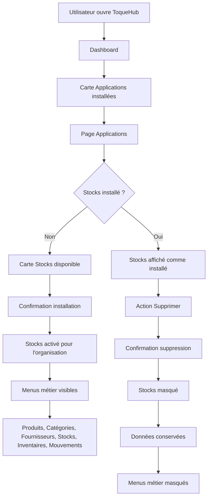

# Plan – Catalogue d’applications ToqueHub

## 1. Objectif produit

Transformer ToqueHub en une plateforme modulaire perçue comme :

> Le système d’exploitation des cuisines professionnelles

L’utilisateur conserve un environnement unique : organisation, utilisateurs, données, authentification, paramètres et design system.  
Le catalogue d’applications sert uniquement à activer ou désactiver des fonctionnalités métier, sans introduire de système de plugins techniques.

---

## 2. Principes retenus

- Toutes les applications partagent le même environnement ToqueHub.
- L’installation et la désinstallation sont persistées côté serveur au niveau de l’organisation.
- L’état des applications est commun à tous les utilisateurs d’une même organisation.
- La désinstallation ne supprime aucune donnée existante.
- La désinstallation masque uniquement les fonctionnalités dans l’interface.
- Les accès techniques directs aux données existantes ne seront pas bloqués dans cette itération.
- Le catalogue doit être premium, moderne, responsive et cohérent avec le reste de ToqueHub.
- Material UI reste la contrainte UI principale.
- Framer Motion est utilisé pour des animations légères et fluides.
- La page Paramètres est ajoutée avec un contenu simple, non vide.

---

## 3. Navigation principale

La navigation principale doit être simplifiée autour de trois entrées principales :

- Dashboard
- Applications
- Paramètres

Les modules métier ne doivent jamais apparaître dans le menu tant que leur application n’est pas installée.

### Avant installation de Stocks

Le menu affiche uniquement :

- Dashboard
- Applications
- Paramètres

Aucune entrée liée aux stocks ne doit être visible.

### Après installation de Stocks

Le menu ajoute automatiquement les entrées métier suivantes :

- Produits
- Catégories
- Fournisseurs
- Stocks
- Inventaires
- Mouvements

Ces entrées disparaissent à nouveau si Stocks est désinstallé.

---

## 4. Page Applications

Créer une page dédiée intitulée :

# Applications

Sous-titre :

> Développez votre environnement ToqueHub en installant les fonctionnalités adaptées à votre établissement.

La page doit donner une impression d’écosystème évolutif, avec une mise en scène premium inspirée de Vercel, Linear, Notion et Raycast.

## 4.1 Mise en scène premium

Ajouter un bandeau ou une zone d’introduction valorisant la vision modulaire de ToqueHub :

- Un seul environnement à administrer
- Des applications métier qui fonctionnent ensemble
- Une plateforme qui s’enrichit progressivement
- Une logique d’ERP moderne pour cuisines professionnelles

Le contenu doit rester sobre, élégant et orienté produit.

---

## 5. Section Applications installées

Afficher une section :

## Applications installées

Elle liste les applications activées pour l’organisation.

### Si aucune application n’est installée

Afficher un état vide non dégradé :

Titre :

> Aucune application installée

Texte :

> Commencez par installer votre première application.

L’état vide doit être visuel, rassurant et inviter à explorer le catalogue.

### Si Stocks est installé

Afficher Stocks comme application active, avec :

- Icône
- Nom
- Courte description
- Statut installé
- Action de suppression

---

## 6. Section Catalogue

Afficher les applications disponibles sous forme de cartes modernes.

Chaque carte contient :

- Icône
- Nom
- Description courte
- Statut
- Bouton d’action

Les cartes doivent être élégantes, responsives, lisibles sur mobile et desktop, avec des animations légères au survol et lors des changements d’état.

---

## 7. Applications disponibles

## 7.1 Stocks

Description :

> Gestion des produits, fournisseurs, stocks, inventaires et mouvements.

Statut :

> Disponible

Action avant installation :

> Installer

Action après installation :

> Installée

Action dans les applications installées :

> Supprimer

---

## 7.2 Recettes

Description :

> Fiches techniques, coûts matières, portions et allergènes.

Statut :

> Bientôt disponible

Action :

> Indisponible

---

## 7.3 Production

Description :

> Planification et suivi de la production cuisine.

Statut :

> Bientôt disponible

Action :

> Indisponible

---

## 7.4 HACCP

Description :

> Suivi qualité, températures et traçabilité.

Statut :

> Bientôt disponible

Action :

> Indisponible

---

## 7.5 Achats

Description :

> Commandes fournisseurs et réceptions.

Statut :

> Bientôt disponible

Action :

> Indisponible

---

## 7.6 RH

Description :

> Gestion de l’équipe et organisation interne.

Statut :

> Bientôt disponible

Action :

> Indisponible

---

## 8. Installation d’une application

Lorsqu’un utilisateur clique sur Installer pour Stocks, afficher une boîte de dialogue de confirmation.

Titre :

> Installer l’application Stocks ?

Texte :

> Cette application ajoutera les fonctionnalités liées à la gestion des stocks à votre environnement.

Boutons :

- Annuler
- Installer

### Après confirmation

- L’installation est enregistrée côté serveur pour l’organisation.
- L’application apparaît dans la section Applications installées.
- La carte du catalogue passe à l’état installée.
- Le bouton devient Installée.
- Le menu latéral se met à jour automatiquement.
- Les entrées Produits, Catégories, Fournisseurs, Stocks, Inventaires et Mouvements deviennent visibles.
- Le Dashboard reflète le nouvel état.

---

## 9. Désinstallation de Stocks

La désinstallation est autorisée uniquement depuis la page Applications.

Action :

> Supprimer

Avant suppression, afficher une boîte de dialogue d’avertissement.

Titre :

> Supprimer l’application Stocks ?

Texte :

> Les données existantes seront conservées mais les fonctionnalités seront masquées.

Boutons :

- Annuler
- Supprimer

### Après confirmation

- L’état installé est retiré côté serveur pour l’organisation.
- Stocks disparaît de la section Applications installées.
- La carte Stocks redevient disponible à l’installation.
- Les menus métier associés disparaissent.
- Les données existantes restent conservées.

### Données explicitement conservées

La suppression ne supprime aucun :

- Produit
- Fournisseur
- Stock
- Inventaire
- Mouvement
- Historique

Elle désactive uniquement l’accès visible à la fonctionnalité dans l’interface.

---

## 10. Dashboard

Ajouter une carte dédiée :

> Applications installées

Exemple si Stocks est installé :

> 1 application active  
> 📦 Stocks

Bouton :

> Gérer les applications

Le bouton mène à la page Applications.

### Si aucune application n’est installée

La carte doit rester présente et inviter l’utilisateur à démarrer :

- Indiquer qu’aucune application n’est active
- Proposer le bouton Gérer les applications
- Ne jamais laisser un espace vide ou ambigu

---

## 11. Page Paramètres

Ajouter une page Paramètres simple, non vide.

Elle doit présenter au minimum :

- Les informations principales de l’organisation
- Le contexte de l’environnement ToqueHub
- Un rappel que les applications partagent la même organisation, les mêmes utilisateurs et les mêmes données

Cette page n’a pas besoin d’offrir une édition avancée dans cette itération.

---

## 12. Persistance serveur

L’état d’installation des applications doit être stocké côté serveur au niveau de l’organisation.

### Comportement attendu

- L’installation est visible par tous les utilisateurs de l’organisation.
- La désinstallation est visible par tous les utilisateurs de l’organisation.
- Le Dashboard, la navigation et la page Applications utilisent le même état serveur.
- L’état local du navigateur ne doit pas être la source de vérité.
- En cas de rechargement ou reconnexion, l’état serveur est restauré.

---

## 13. Cohérence des données

Les données métier existantes restent dans l’environnement même si l’application est désinstallée.

### Exemple

Si l’utilisateur :

1. Installe Stocks
2. Crée des produits et fournisseurs
3. Enregistre des mouvements
4. Désinstalle Stocks
5. Réinstalle Stocks

Alors les produits, fournisseurs, stocks et mouvements existants doivent réapparaître.

---

## 14. Expérience utilisateur

L’utilisateur doit comprendre immédiatement que :

- ToqueHub est modulaire
- Il installe uniquement ce dont son établissement a besoin
- De nouvelles applications arriveront
- Toutes les applications fonctionneront ensemble
- Il n’a qu’un seul environnement à administrer

Le catalogue doit donner une sensation d’écosystème professionnel en évolution, et non une simple liste de fonctionnalités.

---

## 15. Style visuel

Respecter les contraintes suivantes :

- Material UI
- Responsive mobile et desktop
- Framer Motion pour les transitions légères
- Cartes modernes et premium
- États vides soignés
- Dialogues clairs et rassurants
- Aucun écran vide
- Cohérence avec l’identité visuelle existante de ToqueHub

Inspirations visuelles :

- Vercel
- Linear
- Notion
- Raycast

L’ensemble doit donner l’impression d’utiliser un ERP moderne, modulaire et évolutif, conçu spécifiquement pour les cuisines professionnelles.

---

## 16. Parcours cible

---

## 17. Critères d’acceptation

- La navigation principale contient Dashboard, Applications et Paramètres.
- Les menus métier Stocks ne sont pas visibles avant installation.
- La page Applications affiche le titre, le sous-titre, les applications installées et le catalogue.
- Stocks peut être installé après confirmation.
- Stocks peut être supprimé après avertissement.
- La suppression ne supprime aucune donnée métier.
- L’état installé/désinstallé est persistant côté serveur pour l’organisation.
- Le Dashboard affiche une carte Applications installées.
- Le bouton Gérer les applications mène à la page Applications.
- Les applications bientôt disponibles sont visibles mais non installables.
- La page Paramètres existe et n’est pas vide.
- L’interface est responsive, premium et cohérente avec ToqueHub.
- Les animations restent légères et utiles.
