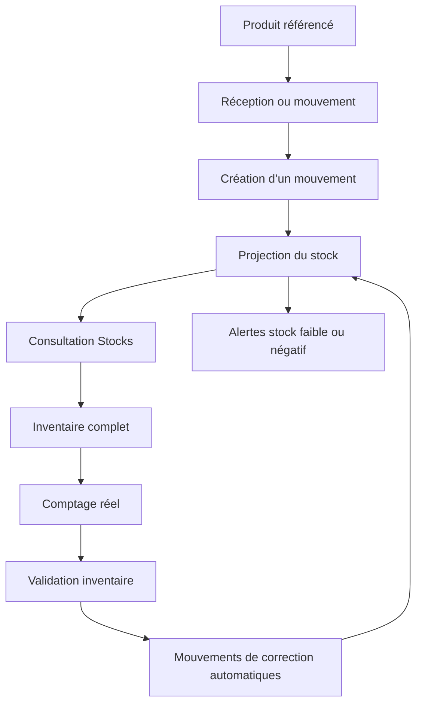
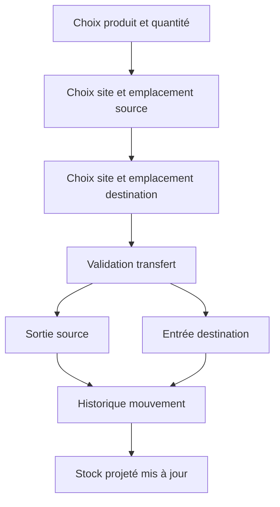
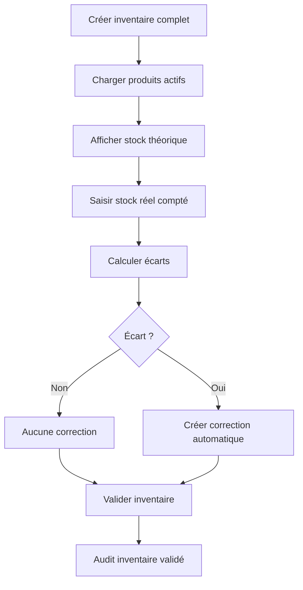

# Plan — ToqueHub Stocks V1 complet

## 1. Objectif du module

Créer le premier module métier officiel de ToqueHub : **Stocks**.

Le module doit permettre à une cuisine professionnelle de gérer :

- Produits
- Catégories
- Unités
- Fournisseurs
- Lots et DLC
- Stocks théoriques
- Mouvements
- Inventaires complets
- Transferts entre sites et emplacements
- Audit métier

Le module doit être utilisable en production pour :

- Restaurants
- EHPAD
- Collectivités
- Traiteurs
- Hôtels
- Cuisines centrales

Le design doit rester moderne, rapide, lisible et adapté au desktop, tablette et mobile.

---

## 2. Principe métier fondamental

Le stock ne doit jamais être modifié directement.

Toute variation de stock doit passer par un **mouvement de stock**.

Le stock affiché est une **projection calculée** à partir des mouvements, enrichie par les lots, les sites et les emplacements.

Exemple :

```text
Réception : +50 kg Farine
Consommation : -10 kg Farine
Perte : -5 kg Farine

Stock affiché : 35 kg
```

Les stocks négatifs sont autorisés en V1, mais doivent être clairement signalés par une alerte visuelle et conservés dans l’historique.

---

## 3. Installation du module

À l’installation du module Stocks :

- Ajouter automatiquement les entrées de navigation du module.
- Rendre visibles les pages métier Stocks.
- Lancer un assistant de préremplissage.
- Conserver les données métier même si le module est désinstallé de l’interface.
- Ne jamais supprimer les historiques existants.

### Assistant de préremplissage

L’assistant doit proposer à l’établissement de préremplir :

- Catégories courantes
- Unités courantes
- Sites
- Emplacements internes
- Éventuellement des exemples métiers utiles

Exemples de catégories :

- Épicerie
- Produits frais
- Surgelés
- Boissons
- Viandes
- Poissons
- Produits laitiers
- Fruits et légumes

Exemples d’unités :

- kg
- g
- L
- mL
- pièce
- barquette
- caisse
- carton
- bac

Exemples d’emplacements :

- Réserve sèche
- Chambre froide positive
- Chambre froide négative
- Congélateur
- Cuisine
- Zone de production
- Quai de réception

---

## 4. Navigation

Une fois le module installé, ajouter au menu :

- Stocks
- Produits
- Catégories
- Unités
- Fournisseurs
- Inventaires
- Mouvements
- Sites & emplacements
- Audit

La navigation doit être responsive et utilisable sur desktop, tablette et mobile.

---

## 5. Tableau de bord Stocks

Créer une page d’accueil dédiée au module.

### Titre

**Stocks**

### Sous-titre

**Vue d’ensemble de votre stock.**

### Cartes statistiques

Afficher :

- Produits  
  Nombre total de produits actifs.

- Fournisseurs  
  Nombre total de fournisseurs actifs.

- Valeur du stock  
  Valeur théorique actuelle calculée à partir du stock projeté et du prix moyen pondéré.

- Mouvements du mois  
  Nombre de mouvements réalisés sur le mois en cours.

### Derniers mouvements

Afficher les derniers mouvements avec les colonnes :

- Date
- Produit
- Type
- Quantité
- Utilisateur

### Produits les plus consommés

Afficher le top des produits sortis du stock sur une période récente.

Les sorties à prendre en compte incluent notamment :

- Sortie
- Production
- Perte
- Correction négative
- Inventaire négatif

---

## 6. Catégories

Créer une page de gestion des catégories.

### Données

Chaque catégorie doit contenir :

- Nom
- Description optionnelle
- Statut actif ou archivé

### Fonctionnalités

- Créer
- Modifier
- Archiver
- Rechercher
- Masquer les éléments archivés par défaut
- Permettre l’affichage des archivés via filtre

L’archivage ne doit pas supprimer les liens historiques avec les produits et mouvements.

---

## 7. Unités

Créer une page de gestion des unités.

### Données

Chaque unité doit contenir :

- Nom
- Symbole
- Type d’unité compatible pour les conversions simples
- Statut actif ou archivé

### Fonctionnalités

- Créer
- Modifier
- Archiver
- Rechercher
- Gérer les conversions simples entre unités compatibles

### Conversions simples

La V1 doit gérer les conversions simples, par exemple :

- kg ↔ g
- L ↔ mL

Un produit garde une unité principale, mais les mouvements peuvent être saisis dans une unité compatible.

Le stock affiché doit rester exprimé dans l’unité principale du produit.

---

## 8. Fournisseurs

Créer une page fournisseurs.

### Données

Chaque fournisseur doit contenir :

- Nom
- Contact
- Téléphone
- Email
- Adresse
- Notes
- Statut actif ou archivé

### Fonctionnalités

- Créer
- Modifier
- Archiver
- Rechercher
- Filtrer actifs / archivés

Les fournisseurs archivés restent visibles dans les historiques de mouvements et de lots.

---

## 9. Produits

Créer la page principale de gestion des produits.

### Données produit

Chaque produit doit contenir :

- Nom
- Référence interne
- Catégorie
- Unité principale
- Fournisseur principal optionnel
- Prix d’achat moyen
- Stock minimum
- Statut actif ou archivé

### Prix d’achat moyen

Le prix d’achat moyen doit être calculé automatiquement selon une logique de moyenne pondérée, principalement à partir des réceptions fournisseur.

La valeur théorique du stock doit s’appuyer sur ce prix moyen pondéré.

### Fonctionnalités

- Créer
- Modifier
- Archiver
- Rechercher
- Filtrer
- Afficher actifs / archivés
- Associer catégorie, unité principale et fournisseur principal
- Afficher les alertes liées au stock minimum

### Affichage liste

Colonnes :

- Nom
- Catégorie
- Stock actuel
- Unité
- Prix moyen
- Statut

---

## 10. Lots et DLC

La V1 doit inclure le suivi des lots et des dates de péremption.

### Données lot

Chaque lot doit pouvoir contenir :

- Produit
- Fournisseur optionnel
- Numéro de lot
- Date de réception
- Date de péremption optionnelle
- Site
- Emplacement
- Quantité projetée

### Comportement

- Une réception fournisseur peut créer ou alimenter un lot.
- Une sortie peut être rattachée à un lot.
- Les stocks doivent pouvoir être consultés par produit, mais aussi détaillés par lot si nécessaire.
- Les lots à DLC proche doivent être visuellement identifiables.
- Les lots épuisés restent consultables dans l’historique.

---

## 11. Sites et emplacements

Les transferts complets étant inclus en V1, le module doit gérer deux niveaux :

- Sites
- Emplacements

### Site

Un site représente une entité physique ou opérationnelle de l’organisation.

Exemples :

- Restaurant principal
- Cuisine centrale
- Satellite
- Hôtel
- EHPAD

### Emplacement

Un emplacement appartient à un site.

Exemples :

- Réserve sèche
- Chambre froide
- Congélateur
- Cuisine
- Zone de production

### Fonctionnalités

- Créer des sites
- Modifier des sites
- Archiver des sites
- Créer des emplacements
- Modifier des emplacements
- Archiver des emplacements
- Rechercher
- Filtrer actifs / archivés

Les sites et emplacements archivés restent visibles dans l’historique.

---

## 12. Page Stocks

Créer une page Stocks en lecture seule.

Aucune modification directe ne doit être autorisée.

### Colonnes

- Produit
- Catégorie
- Stock actuel
- Unité
- Valeur stock
- Seuil minimum
- Statut

### Vue détaillée

Permettre de consulter le détail par :

- Site
- Emplacement
- Lot
- DLC

### Indicateurs

Afficher clairement :

- Stock normal
- Stock faible
- Rupture
- Stock négatif

### Couleurs

- Vert : stock normal
- Orange : stock faible
- Rouge : rupture ou stock négatif

Le stock négatif est autorisé mais doit être visuellement explicite.

---

## 13. Mouvements

La page Mouvements est le cœur du module.

Tous les changements de stock passent par cette page.

### Types de mouvements

La V1 doit gérer :

- Entrée
- Sortie
- Correction
- Inventaire
- Production
- Perte
- Transfert

### Création d’un mouvement

Un mouvement doit contenir :

- Produit
- Type
- Quantité
- Unité de saisie compatible
- Lot optionnel ou obligatoire selon le contexte
- Fournisseur optionnel
- Site source optionnel selon le type
- Emplacement source optionnel selon le type
- Site destination optionnel selon le type
- Emplacement destination optionnel selon le type
- Commentaire
- Date

### Règles métier

- Entrée : augmente le stock.
- Sortie : diminue le stock.
- Production : peut consommer ou produire selon le sens métier choisi.
- Perte : diminue le stock.
- Correction : ajuste le stock avec justification.
- Inventaire : utilisé automatiquement lors de la validation d’un inventaire.
- Transfert : déplace une quantité d’un site/emplacement vers un autre sans changer le stock total de l’organisation.

### Stock négatif

- Autorisé.
- Signalé par alerte.
- Conservé dans l’historique.
- Visible dans les pages Stocks et Produits.

### Historique

Colonnes :

- Date
- Produit
- Type
- Quantité
- Utilisateur
- Commentaire

### Filtres

- Date
- Produit
- Type
- Utilisateur
- Site
- Emplacement
- Fournisseur
- Lot

---

## 14. Transferts

Les transferts doivent être complets dès la V1.

### Objectif

Déplacer du stock entre :

- Deux sites
- Deux emplacements d’un même site
- Deux emplacements de sites différents

### Comportement

Un transfert doit :

- Retirer la quantité du site/emplacement source.
- Ajouter la quantité au site/emplacement destination.
- Conserver le même produit.
- Conserver le lot si le transfert concerne un lot.
- Être traçable dans l’historique.
- Ne pas modifier la valeur totale du stock de l’organisation.

### Exemple

```text
Produit : Farine
Quantité : 10 kg
Source : Cuisine centrale / Réserve sèche
Destination : Restaurant principal / Cuisine

Effet :
-10 kg source
+10 kg destination
```

---

## 15. Inventaires

Créer une page Inventaires.

La V1 doit gérer des inventaires complets.

### Création d’un inventaire

Données :

- Nom
- Date
- Commentaire
- Site concerné si applicable
- Emplacement concerné si applicable

### Liste des produits

Pour chaque produit actif :

- Produit
- Stock théorique
- Stock réel compté
- Écart

Le comptage doit pouvoir tenir compte des lots lorsque le produit est suivi par lot.

### Validation

À la validation :

- Comparer stock théorique et stock réel.
- Créer automatiquement les mouvements de correction nécessaires.
- Ajouter un motif clair : **Correction inventaire**.
- Historiser la validation.
- Empêcher la modification de l’inventaire validé.

### Exemple

```text
Théorique : 100 kg
Réel : 95 kg
Correction créée : -5 kg
Motif : Correction inventaire
```

---

## 16. Recherche et filtres

La V1 doit privilégier une recherche par page plutôt qu’une recherche globale.

Chaque page métier doit proposer une recherche rapide adaptée :

- Produits : nom, référence, catégorie
- Fournisseurs : nom, contact, email
- Catégories : nom
- Unités : nom, symbole
- Mouvements : produit, type, utilisateur, commentaire
- Inventaires : nom, date, statut
- Stocks : produit, catégorie, site, emplacement, lot

Les filtres doivent être rapides, visibles et faciles à réinitialiser.

---

## 17. Permissions

Prévoir dès la V1 trois rôles :

- Administrateur
- Manager
- Utilisateur

### Administrateur

Accès complet :

- Installation / désinstallation du module
- Gestion complète des référentiels
- Gestion complète des produits
- Gestion complète des fournisseurs
- Gestion des sites et emplacements
- Création de mouvements
- Validation d’inventaires
- Consultation audit
- Export audit CSV

### Manager

Gestion opérationnelle :

- Gestion des stocks
- Gestion des produits
- Gestion des fournisseurs
- Gestion des catégories et unités
- Création de mouvements
- Validation d’inventaires
- Consultation audit
- Export audit CSV

### Utilisateur

Accès terrain :

- Consultation des stocks
- Consultation des produits
- Création de mouvements
- Participation aux inventaires selon autorisation
- Pas de gestion des référentiels sensibles
- Pas d’export audit

---

## 18. Archivage

La V1 doit utiliser l’archivage uniquement.

Aucune suppression métier réelle ne doit être proposée pour :

- Produits
- Catégories
- Unités
- Fournisseurs
- Sites
- Emplacements

### Règles

- Un élément archivé est masqué par défaut dans les listes actives.
- Un élément archivé reste visible dans les historiques.
- Un produit archivé ne peut plus être utilisé dans de nouveaux mouvements standards.
- Les mouvements historiques restent inchangés.
- Les rapports et audits doivent conserver les noms historiques.

---

## 19. Audit

Toutes les actions importantes doivent être historisées.

### Actions à historiser

Exemples :

- Produit créé
- Produit modifié
- Produit archivé
- Fournisseur créé
- Fournisseur modifié
- Fournisseur archivé
- Catégorie créée
- Unité créée
- Site créé
- Emplacement créé
- Mouvement ajouté
- Inventaire créé
- Inventaire validé
- Transfert effectué
- Module Stocks installé
- Module Stocks désinstallé de l’interface

### Journal d’audit

Créer un journal consultable par Administrateur et Manager.

### Filtres

- Date
- Utilisateur
- Type d’action
- Entité concernée

### Export

Prévoir un export CSV du journal d’audit pour les contrôles internes.

---

## 20. Design et expérience utilisateur

### Technologies UI imposées

- Material UI
- Framer Motion

### Style

Inspirations :

- Linear
- Notion
- Vercel
- Stripe

### Contraintes visuelles

- Mode clair en V1
- Préparer le mode sombre futur
- Cartes modernes
- Tables performantes
- Filtres rapides
- Chargements élégants
- États vides travaillés
- Aucune page vide
- Interface fluide et sobre

### Responsive

Le module doit être utilisable sur :

- Desktop
- Tablette
- Mobile

### États vides

Chaque page doit proposer un état vide utile :

- Message clair
- Explication courte
- Action principale visible
- Exemple métier si pertinent

---

## 21. Tableaux et performance

Les tables doivent rester performantes avec un volume de données croissant.

Prévoir :

- Pagination
- Tri
- Filtres rapides
- Recherche locale par page
- États de chargement
- États d’erreur compréhensibles
- Affichage compact sur mobile

Les pages à fort volume concernent surtout :

- Mouvements
- Stocks
- Inventaires
- Audit

---

## 22. Tableau de bord — logique des indicateurs

### Produits

Compter les produits non archivés par défaut.

### Fournisseurs

Compter les fournisseurs non archivés par défaut.

### Valeur du stock

Calculer :

```text
Stock actuel projeté × prix moyen pondéré
```

Additionner ensuite la valeur de tous les produits.

### Mouvements du mois

Compter les mouvements créés depuis le début du mois courant.

### Produits les plus consommés

Classer les produits selon les quantités sorties sur une période récente.

---

## 23. Flux métier principal



---

## 24. Flux de transfert



---

## 25. Flux d’inventaire



---

## 26. Données à prévoir

Le module doit couvrir les concepts métier suivants :

- Organisation
- Utilisateur
- Rôle
- Produit
- Catégorie
- Unité
- Conversion d’unité
- Fournisseur
- Site
- Emplacement
- Lot
- Stock projeté
- Mouvement de stock
- Inventaire
- Ligne d’inventaire
- Journal d’audit

---

## 27. Compatibilité long terme

Le module Stocks doit devenir la première brique métier fondamentale de ToqueHub.

Les futurs modules devront réutiliser les données Stocks :

- Recettes
- Production
- Achats
- Menus
- HACCP
- Reporting

Les entités suivantes doivent donc être pensées comme partagées :

- Produits
- Fournisseurs
- Catégories
- Unités
- Lots
- Stocks
- Mouvements
- Sites
- Emplacements

---

## 28. Priorisation de réalisation

### Phase 1 — Socle métier

- Finaliser produits, catégories, unités, fournisseurs.
- Ajouter archivage.
- Ajouter prix moyen pondéré.
- Ajouter stock minimum.
- Ajouter conversions simples.
- Ajouter sites et emplacements.
- Ajouter lots et DLC.

### Phase 2 — Mouvements robustes

- Étendre les types de mouvements.
- Ajouter transferts complets.
- Ajouter rattachement site, emplacement et lot.
- Autoriser stock négatif avec alerte.
- Fiabiliser l’historique.

### Phase 3 — Stocks et tableau de bord

- Créer la page Stocks lecture seule.
- Ajouter indicateurs vert / orange / rouge.
- Ajouter valeur théorique du stock.
- Ajouter derniers mouvements.
- Ajouter produits les plus consommés.

### Phase 4 — Inventaires

- Créer inventaires complets.
- Saisir le stock réel.
- Calculer les écarts.
- Générer corrections automatiques.
- Verrouiller les inventaires validés.

### Phase 5 — Permissions et audit

- Appliquer les trois rôles V1.
- Ajouter journal d’audit.
- Ajouter filtres audit.
- Ajouter export CSV.

### Phase 6 — Expérience utilisateur

- Harmoniser le design Material UI.
- Ajouter animations Framer Motion.
- Améliorer responsive.
- Ajouter états vides.
- Ajouter chargements élégants.
- Finaliser filtres et recherches par page.

---

## 29. Critères d’acceptation V1

Le module est considéré complet lorsque :

- Le stock ne peut jamais être modifié directement.
- Tout changement passe par un mouvement.
- Les stocks affichés sont cohérents avec les mouvements.
- Les mouvements couvrent entrée, sortie, correction, inventaire, production, perte et transfert.
- Les transferts fonctionnent entre sites et emplacements.
- Les lots et DLC sont gérés.
- Les inventaires complets créent automatiquement les corrections nécessaires.
- Les stocks négatifs sont autorisés mais clairement signalés.
- Les produits, fournisseurs, catégories, unités, sites et emplacements sont archivables.
- La valeur du stock est calculée avec un prix moyen pondéré.
- Les conversions simples d’unités sont disponibles.
- Les trois rôles V1 sont appliqués.
- Toutes les actions importantes sont auditées.
- L’audit est consultable et exportable en CSV.
- Chaque page dispose d’une recherche ou de filtres adaptés.
- L’interface est responsive.
- Aucune page n’est vide ou brute.
- Le module peut servir de fondation aux futurs modules ToqueHub.
