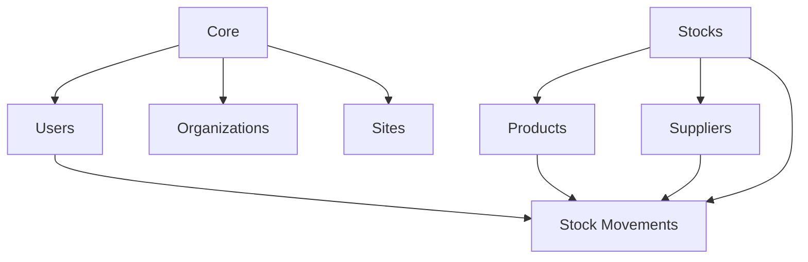

# Plan – Centre d’Architecture & Cartographie des Données ToqueHub

## 1. Objectif général

Créer un mini-centre d’architecture réservé aux administrateurs, permettant de comprendre rapidement :

- la structure globale de ToqueHub ;
- les modules réellement existants aujourd’hui ;
- les tables et relations de la base PostgreSQL ;
- les dépendances entre modules ;
- la propriété unique des données ;
- les réutilisations entre modules ;
- les risques de duplication de données ;
- l’impact potentiel d’un module sur le reste du système.

Ce centre doit devenir une source de vérité interne, en lecture seule pour la première version.

---

## 2. Décisions validées

### Automatisation

La première version doit utiliser une analyse automatique côté API.

Le centre doit lire le schéma réel et calculer automatiquement :

- les modèles ;
- les champs ;
- les relations ;
- les clés étrangères ;
- les compteurs ;
- les dépendances ;
- les alertes de doublons.

### Accès

Le menu Architecture est visible uniquement pour les administrateurs.

### Organisation UX

La première version prend la forme d’un mini-centre structuré, accessible depuis les paramètres avancés.

### Graphes

Les graphes sont interactifs simples :

- zoom ;
- déplacement ;
- sélection de nœud ;
- liens lisibles ;
- visualisation claire des dépendances.

### Détection des doublons

Les doublons doivent être présentés avec des niveaux d’alerte.

Exemples de niveaux :

- information ;
- attention ;
- critique.

Aucune action bloquante n’est prévue en v1.

### Documentation automatique

La documentation est générée automatiquement et consultable en interne uniquement.

### Modules couverts en v1

La v1 se limite aux modules réellement existants aujourd’hui.

Les modules planifiés ne doivent pas être présentés comme des modules installés ou actifs.

### Édition

La cartographie est en lecture seule en v1.

L’édition des métadonnées pourra être prévue plus tard.

---

## 3. Règle fondamentale d’architecture

Chaque donnée possède un propriétaire unique.

Les autres modules doivent consommer la donnée existante au lieu de la recréer.

Exemples de propriété métier :

- Users → Core
- Organizations → Core
- Sites → Core
- Products → Stocks
- Categories → Stocks
- Units → Stocks
- Suppliers → Stocks
- Stocks → Stocks
- Stock Movements → Stocks

En v1, seules les données réellement présentes dans le système sont cartographiées.

---

## 4. Emplacement dans l’interface

Ajouter une entrée :

**Paramètres avancés → Architecture**

Visible uniquement pour les administrateurs.

Le libellé du menu :

**Architecture**

L’entrée ouvre le mini-centre :

**Architecture ToqueHub**

Sous-titre :

**Visualisez l’ensemble de votre environnement et des relations entre les modules.**

---

## 5. Structure du mini-centre

Le mini-centre contient une vue synthétique et plusieurs sections internes.

Sections prévues :

1. Vue globale
2. Modules
3. Data Map
4. Relations
5. Schéma Prisma
6. Détection des doublons
7. Impact d’un module
8. Roadmap Architecture
9. Documentation interne

---

## 6. Dashboard développeur

Afficher en haut du mini-centre une synthèse rapide.

Indicateurs à afficher :

- nombre de modules ;
- nombre de tables ;
- nombre de relations ;
- nombre d’utilisateurs ;
- nombre d’organisations ;
- nombre de produits ;
- nombre de fournisseurs.

Ces indicateurs doivent provenir de l’analyse réelle et des données existantes.

Objectif : donner une lecture immédiate de l’état du système.

---

## 7. Section 1 – Vue globale

### Objectif

Permettre de comprendre rapidement la structure actuelle du système.

### Contenu

Afficher une vue d’ensemble hiérarchique et visuelle :

- ToqueHub ;
- Core ;
- applications installées ;
- applications disponibles si elles existent déjà dans le système ;
- base de données ;
- principales familles de données détectées.

### Comportement attendu

La vue doit distinguer clairement :

- le cœur système ;
- les modules installés ;
- les données appartenant à chaque module ;
- les données seulement consommées par d’autres parties du système.

---

## 8. Section 2 – Modules

### Objectif

Afficher les modules existants sous forme de cartes lisibles.

### Carte module

Chaque carte doit présenter :

- nom du module ;
- statut ;
- description ;
- données possédées ;
- données consommées ;
- modules consommateurs ;
- dépendances connues.

### Modules v1

La première version doit se limiter aux modules réellement existants.

Pour l’état actuel du projet, les cartes principales attendues sont :

#### Core

Description :

**Fondation du système.**

Possède notamment :

- organisations ;
- utilisateurs ;
- rôles ;
- permissions ;
- paramètres système liés à l’organisation ;
- rattachements d’applications installées.

#### Stocks

Description :

**Gestion des stocks.**

Possède notamment :

- produits ;
- catégories ;
- unités ;
- fournisseurs ;
- stocks ;
- mouvements ;
- lots ;
- inventaires ;
- sites et emplacements si ces données sont actuellement gérées par ce périmètre.

Utilisé par :

- les autres modules futurs devront consommer ces données au lieu de les dupliquer.

---

## 9. Section 3 – Data Map

### Objectif

Créer une cartographie complète et lisible des données.

### Format

Afficher un tableau avec les colonnes :

- Table ;
- Module propriétaire ;
- Modules consommateurs ;
- Description ;
- Niveau de confiance ;
- Origine de l’information.

### Origine de l’information

La cartographie doit indiquer si l’information vient :

- de l’analyse automatique du schéma ;
- de règles métier internes ;
- d’une déduction par relation ;
- d’une convention de nommage.

### Exemples attendus

#### users

Propriétaire :

**Core**

Consommateurs :

- Stocks ;
- autres modules futurs selon les dépendances détectées.

Description :

**Comptes utilisateurs ToqueHub.**

#### products

Propriétaire :

**Stocks**

Consommateurs :

- Stocks ;
- modules futurs qui devront réutiliser les produits.

Description :

**Produits de référence.**

#### suppliers

Propriétaire :

**Stocks**

Consommateurs :

- Stocks ;
- futurs achats.

Description :

**Fournisseurs.**

---

## 10. Section 4 – Relations

### Objectif

Visualiser les dépendances du système à travers des nœuds reliés.

### Type de visualisation

Créer un graphe interactif simple.

Fonctionnalités :

- zoom ;
- déplacement ;
- sélection d’un nœud ;
- mise en évidence des liens directs ;
- détail latéral ou contextuel du nœud sélectionné.

### Types de nœuds

Le graphe doit pouvoir représenter :

- modules ;
- tables ;
- entités centrales ;
- relations principales.

### Types de liens

Les liens doivent représenter :

- propriété ;
- consommation ;
- relation directe entre tables ;
- dépendance fonctionnelle.

### Exemple conceptuel

---

## 11. Section 5 – Schéma Prisma

### Objectif

Lire automatiquement le schéma Prisma et afficher une vue simplifiée.

### Informations à afficher

Pour chaque modèle :

- nom du modèle ;
- table correspondante ;
- champs ;
- types principaux ;
- champs obligatoires ou optionnels ;
- relations ;
- clés étrangères ;
- index principaux si disponibles ;
- contraintes uniques si disponibles.

### Présentation

La vue doit rester lisible et ne pas ressembler à un éditeur technique brut.

Pour chaque modèle, afficher :

- une carte ou un panneau ;
- la liste des champs ;
- une zone dédiée aux relations ;
- une indication du module propriétaire si déterminable.

---

## 12. Section 6 – Détection des doublons

### Objectif

Détecter les futures erreurs d’architecture et éviter la recréation de données déjà existantes.

### Analyse automatique

L’analyse doit comparer les tables et modèles selon :

- similarité de nom ;
- synonymes métier connus ;
- proximité de champs ;
- similarité de responsabilités ;
- relations avec les mêmes entités ;
- éventuels doublons conceptuels.

### Niveaux d’alerte

Afficher les alertes selon trois niveaux :

#### Information

Risque faible ou simple proximité de nom.

#### Attention

Risque probable de duplication fonctionnelle.

#### Critique

Risque fort de recréer une donnée déjà propriétaire ailleurs.

### Exemples d’alertes

- La table “ingredients” semble pouvoir dupliquer “products”.
- La table “workers” semble pouvoir dupliquer “employees”.
- La table “vendors” semble pouvoir dupliquer “suppliers”.

### Comportement v1

Les alertes sont consultatives.

Elles ne bloquent pas encore le développement.

---

## 13. Section 7 – Impact d’un module

### Objectif

Comprendre les conséquences d’un module sur le reste du système.

### Fonctionnement

Afficher une sélection de module.

Après sélection, présenter :

- tables possédées ;
- tables utilisées ;
- modules dépendants ;
- modules impactés ;
- risques en cas de désactivation ;
- dépendances critiques.

### Exemple avec Stocks

Afficher :

Tables possédées :

- produits ;
- catégories ;
- unités ;
- fournisseurs ;
- stocks ;
- mouvements ;
- lots ;
- inventaires.

Impact potentiel :

- produits indisponibles ;
- mouvements de stock indisponibles ;
- fournisseurs non exploitables ;
- futurs modules Recettes, Production et Achats impactés lorsqu’ils seront ajoutés.

---

## 14. Section 8 – Roadmap Architecture

### Objectif

Visualiser l’évolution globale du projet sans confondre les modules existants et les modules planifiés.

### V1

Afficher uniquement les modules existants comme actifs.

Les modules futurs peuvent être absents de la v1, ou mentionnés uniquement dans une zone séparée non active si le produit le souhaite plus tard.

### Statuts possibles

Prévoir une structure compatible avec :

- terminé ;
- en développement ;
- planifié ;
- indisponible ;
- déprécié.

### Affichage actuel attendu

Exemples :

- Core — actif ;
- Stocks — actif ou installé selon l’état réel.

---

## 15. Section 9 – Documentation automatique

### Objectif

Permettre à un nouveau développeur de comprendre ToqueHub en quelques minutes.

### Pages internes générées

Créer des pages internes en lecture seule :

- Architecture ;
- Modules ;
- Tables ;
- Relations ;
- Roadmap.

### Contenu des pages

Chaque page doit être générée à partir de l’analyse automatique et de la cartographie v1.

La documentation doit expliquer :

- ce que possède chaque module ;
- quelles données sont centrales ;
- quelles tables sont liées ;
- quelles règles de propriété doivent être respectées ;
- quels risques de doublon existent.

---

## 16. API d’analyse d’architecture

Créer un périmètre API dédié à l’architecture.

### Responsabilités

L’API doit fournir :

- résumé global ;
- liste des modules ;
- cartographie des tables ;
- relations détectées ;
- schéma Prisma simplifié ;
- alertes de doublons ;
- analyse d’impact par module ;
- données de documentation interne.

### Accès

Tous les points d’accès doivent être protégés.

Seuls les administrateurs peuvent consulter ces données.

### Données calculées

L’API doit combiner :

- analyse du schéma ;
- compteurs réels ;
- relations détectées ;
- règles métier de propriété ;
- état réel des modules installés.

---

## 17. Sécurité et permissions

### Règle d’accès

Le centre est strictement réservé aux administrateurs.

### Comportement attendu

- Un administrateur voit le menu Architecture.
- Un utilisateur non administrateur ne voit pas le menu.
- Un utilisateur non administrateur ne peut pas appeler l’API d’architecture.
- En cas d’accès non autorisé, l’API renvoie une erreur adaptée.

---

## 18. Design et expérience utilisateur

### Inspirations

Le design doit s’inspirer de :

- Linear ;
- Vercel ;
- Prisma Studio ;
- Supabase Studio ;
- Grafana.

### Contraintes

Respecter :

- Material UI ;
- responsive design ;
- Framer Motion ;
- graphes interactifs ;
- recherche globale ;
- filtres ;
- interface premium.

### Ton visuel

L’interface doit être :

- claire ;
- dense mais lisible ;
- élégante ;
- orientée développeur ;
- adaptée aux administrateurs ;
- utilisable rapidement sans formation.

---

## 19. Recherche et filtres

Ajouter une recherche globale dans le mini-centre.

Elle doit permettre de retrouver :

- un module ;
- une table ;
- un modèle ;
- un champ ;
- une relation ;
- une alerte ;
- une page de documentation.

Ajouter des filtres selon les vues :

- module propriétaire ;
- module consommateur ;
- niveau d’alerte ;
- type de relation ;
- statut du module ;
- table ou modèle.

---

## 20. Responsive

L’interface doit rester exploitable sur :

- desktop ;
- tablette ;
- mobile.

Sur petit écran :

- les tableaux doivent rester lisibles ;
- les cartes doivent s’empiler ;
- les graphes doivent rester consultables ;
- les détails peuvent s’ouvrir dans un panneau ou une vue dédiée.

---

## 21. États d’interface

Prévoir les états suivants :

- chargement ;
- absence de données ;
- erreur d’analyse ;
- accès refusé ;
- aucune alerte de doublon ;
- aucun module sélectionné ;
- module non installé ;
- schéma indisponible.

---

## 22. Critères d’acceptation

La fonctionnalité est considérée prête lorsque :

- le menu Architecture est visible uniquement pour les administrateurs ;
- le mini-centre affiche le titre et le sous-titre demandés ;
- le dashboard développeur affiche les compteurs réels ;
- la vue globale permet de comprendre la structure actuelle ;
- les modules existants sont affichés sous forme de cartes ;
- la Data Map liste les tables avec propriétaire et consommateurs ;
- le graphe de relations est lisible et interactif simplement ;
- le schéma Prisma est lu automatiquement et présenté sous forme simplifiée ;
- les doublons potentiels sont détectés avec niveaux d’alerte ;
- l’impact d’un module peut être consulté ;
- la roadmap distingue clairement les modules réellement existants ;
- la documentation interne est générée automatiquement ;
- les routes d’analyse sont protégées côté API ;
- l’interface respecte Material UI, Framer Motion, responsive design, recherche, filtres et rendu premium.

---

## 23. Évolutions futures possibles

Après la v1, prévoir éventuellement :

- édition des métadonnées par les administrateurs ;
- export de documentation ;
- garde-fou bloquant contre les duplications critiques ;
- intégration dans le processus de création de nouveaux modules ;
- comparaison entre versions de schéma ;
- historique des changements d’architecture ;
- validation automatique des règles de propriété ;
- annotations développeur ;
- documentation publique ou exportable ;
- graphe avancé avec filtres profonds et analyse de chemins d’impact.
