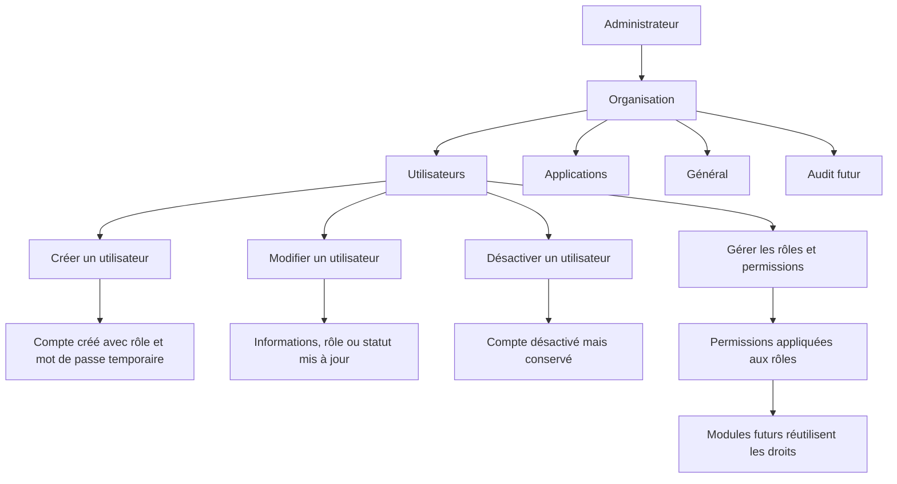

# Plan — ToqueHub Core : gestion centrale des utilisateurs

## 1. Objectif

Mettre en place un référentiel central des utilisateurs ToqueHub au niveau du Core.

Ce référentiel doit représenter uniquement les personnes ayant accès à ToqueHub, sans introduire de notion d’employé dans le Core.

Les futurs modules devront pouvoir réutiliser ces utilisateurs pour leurs propres besoins métier sans recréer d’identité utilisateur.

Exemples futurs :

- RH : associer un employé à un utilisateur ToqueHub, si nécessaire.
- HACCP : associer une action qualité à un utilisateur.
- Stocks : associer un mouvement à un utilisateur.
- Production : associer une production à un utilisateur.

---

## 2. Principes fonctionnels

### 2.1 Utilisateur Core

Un utilisateur ToqueHub correspond à une personne pouvant accéder à l’environnement ToqueHub.

Un utilisateur n’est pas forcément un employé de l’établissement.

Le Core gère uniquement :

- les utilisateurs ;
- leur identité de connexion ;
- leur rôle ;
- leurs permissions ;
- leur statut ;
- leur rattachement à l’organisation ;
- leur historique technique nécessaire à l’exploitation.

Le Core ne gère pas :

- les contrats ;
- les postes RH ;
- les plannings RH ;
- les informations d’employé ;
- les données administratives du personnel.

Ces notions seront réservées au futur module RH.

---

## 3. Rôles et permissions

### 3.1 Rôles disponibles

La première version doit proposer les rôles suivants :

- Administrateur
- Manager
- Utilisateur

### 3.2 Permissions fines

Les rôles ne doivent pas être de simples libellés.

Chaque rôle doit pouvoir porter une liste de permissions fines.

Les permissions doivent être modifiables par rôle dans l’interface d’administration.

### 3.3 Gestion des permissions

Seul un Administrateur peut gérer :

- les utilisateurs ;
- les rôles ;
- les permissions associées aux rôles ;
- les changements de statut ;
- le switch utilisateur de développement, lorsque celui-ci est activé.

### 3.4 Comportement attendu

Le système doit permettre :

- d’afficher les permissions associées à chaque rôle ;
- de modifier les permissions d’un rôle ;
- de conserver les trois rôles de base ;
- de préparer une extension future vers des permissions propres aux modules.

Les permissions doivent être pensées comme une fondation réutilisable par les futurs modules.

---

## 4. Statuts utilisateur

Les statuts disponibles sont :

- Actif
- Invité
- Désactivé

### 4.1 Actif

L’utilisateur peut se connecter et utiliser ToqueHub selon son rôle et ses permissions.

### 4.2 Invité

L’utilisateur est créé mais son accès est en attente de finalisation.

Dans cette version, l’administrateur définit un mot de passe temporaire lors de la création.

L’utilisateur invité pourra ensuite utiliser ce mot de passe temporaire selon le parcours prévu.

### 4.3 Désactivé

L’utilisateur ne peut plus se connecter.

Il reste visible dans le référentiel afin de préserver l’historique.

Aucun utilisateur ne doit être supprimé définitivement.

---

## 5. Administrateur principal

L’utilisateur ayant créé l’environnement ToqueHub est l’Administrateur principal.

Règles :

- il est Administrateur ;
- il ne peut pas être supprimé ;
- il ne peut pas être désactivé ;
- son rôle est verrouillé ;
- son statut est verrouillé ;
- ses informations personnelles peuvent rester modifiables si cela ne remet pas en cause son rôle ou son statut.

L’interface doit rendre cette protection explicite, par exemple avec un badge ou un message d’aide.

---

## 6. Navigation

Ajouter une section dans les paramètres nommée :

## Organisation

Elle doit contenir :

- Général
- Utilisateurs
- Applications
- Audit, marqué comme futur ou indisponible si non finalisé

La page Utilisateurs doit devenir un élément central de cette section.

---

## 7. Page Utilisateurs

### 7.1 Titre

**Utilisateurs**

### 7.2 Sous-titre

**Gérez les personnes ayant accès à votre environnement ToqueHub.**

### 7.3 Contenu principal

Afficher les utilisateurs sous forme de tableau moderne, responsive et premium.

Colonnes :

- Avatar
- Nom complet
- Email
- Rôle
- Statut
- Dernière connexion
- Actions

### 7.4 États d’affichage

Prévoir :

- état de chargement ;
- état vide travaillé ;
- état d’erreur ;
- état sans résultat après recherche ou filtre ;
- affichage adapté mobile et desktop.

### 7.5 Actions disponibles

Depuis la liste, un Administrateur doit pouvoir :

- créer un utilisateur ;
- modifier un utilisateur ;
- désactiver un utilisateur ;
- changer son rôle ;
- changer son statut ;
- consulter les informations principales.

La suppression définitive ne doit pas exister.

---

## 8. Création d’utilisateur

### 8.1 Bouton principal

**Créer un utilisateur**

### 8.2 Formulaire

Champs attendus :

- Prénom
- Nom
- Email
- Rôle
- Mot de passe temporaire

### 8.3 Rôle

Le rôle doit être choisi parmi :

- Administrateur
- Manager
- Utilisateur

### 8.4 Comportement à la création

À la validation :

- créer le compte utilisateur ;
- rattacher l’utilisateur à l’organisation courante ;
- appliquer le rôle sélectionné ;
- enregistrer le mot de passe temporaire ;
- définir le statut initial selon le parcours retenu, avec une logique cohérente entre invitation et accès temporaire ;
- empêcher les doublons d’email ;
- retourner l’utilisateur créé dans la liste.

### 8.5 Expérience utilisateur

Après création :

- afficher un retour de succès ;
- permettre de voir immédiatement le nouvel utilisateur ;
- indiquer clairement que le mot de passe est temporaire.

---

## 9. Modification d’utilisateur

Un Administrateur doit pouvoir modifier :

- prénom ;
- nom ;
- email ;
- rôle ;
- statut.

Contraintes :

- ne pas permettre de désactiver l’Administrateur principal ;
- ne pas permettre de modifier le rôle de l’Administrateur principal ;
- empêcher les changements qui laisseraient l’organisation sans administrateur valide ;
- conserver l’utilisateur dans l’historique même s’il est désactivé.

---

## 10. Désactivation

Action disponible :

**Désactiver**

Comportement :

- le compte devient Désactivé ;
- l’utilisateur ne peut plus se connecter ;
- les données liées à l’utilisateur restent conservées ;
- l’utilisateur reste visible dans la liste ;
- les futurs modules pourront toujours référencer cet utilisateur pour l’historique.

Prévoir une confirmation claire avant désactivation.

---

## 11. Dernière connexion

La liste doit afficher la dernière connexion connue.

Comportement attendu :

- mettre à jour la dernière connexion lors d’une connexion réussie ;
- afficher une valeur lisible ;
- afficher une mention adaptée si l’utilisateur ne s’est jamais connecté.

---

## 12. Switch utilisateur — développement et démonstration

### 12.1 Objectif

Ajouter un switch utilisateur dans le menu utilisateur en haut à droite afin de faciliter les tests des rôles et permissions.

Exemple :

- Paul Breton — Administrateur
- Jean Dupont — Manager
- Marie Martin — Utilisateur
- Créer un utilisateur

### 12.2 Activation

Le switch doit être activable par option de configuration.

Il doit pouvoir être désactivé facilement plus tard.

Il est destiné uniquement :

- au développement ;
- aux démonstrations ;
- aux tests rapides de permissions.

### 12.3 Accès

Seul un Administrateur peut utiliser ce switch lorsque l’option est activée.

### 12.4 Comportement

Le switch doit permettre :

- de lister les utilisateurs existants de l’organisation ;
- de basculer rapidement vers un utilisateur ;
- de refléter immédiatement le rôle et les permissions de l’utilisateur sélectionné ;
- de revenir à un autre utilisateur si nécessaire ;
- d’accéder rapidement à la création d’un utilisateur.

Le système doit indiquer visuellement qu’il s’agit d’un mode développement ou démonstration.

---

## 13. Tableau de bord

Ajouter une nouvelle carte au tableau de bord.

### 13.1 Titre

**Utilisateurs**

### 13.2 Valeur

Nombre d’utilisateurs actifs.

### 13.3 Bouton

**Gérer les utilisateurs**

### 13.4 Comportement

Le bouton doit ouvrir la page Utilisateurs dans la section Organisation.

La carte doit suivre le style premium existant du tableau de bord.

---

## 14. Préparation pour les futurs modules

Le référentiel utilisateurs doit devenir une fondation Core.

Les futurs modules devront pouvoir :

- récupérer la liste des utilisateurs ;
- référencer un utilisateur dans leurs propres actions métier ;
- distinguer un utilisateur actif d’un utilisateur désactivé ;
- conserver les références historiques même si le compte est désactivé ;
- utiliser les permissions comme base d’autorisation.

### 14.1 Module RH

Le futur module RH pourra associer un employé à un utilisateur ToqueHub, sans obligation.

Cas possibles :

- une personne est employée RH et utilisatrice ToqueHub ;
- une personne est employée RH sans compte ToqueHub ;
- une personne est utilisatrice ToqueHub sans être employée RH.

### 14.2 Module HACCP

Les actions qualité pourront être associées à un utilisateur ToqueHub.

### 14.3 Module Stocks

Les mouvements de stock pourront continuer à être associés à un utilisateur ToqueHub.

### 14.4 Module Production

Les productions pourront être associées à un utilisateur ToqueHub.

---

## 15. Audit

L’audit des actions utilisateurs est reporté à plus tard.

Pour cette version :

- ne pas rendre obligatoire l’affichage des événements utilisateurs dans l’audit ;
- ne pas faire de la section Audit un prérequis de livraison ;
- garder la conception compatible avec un futur audit des actions telles que création, modification, désactivation, changement de rôle, changement de permissions et switch utilisateur.

---

## 16. Design et expérience utilisateur

Respecter l’identité visuelle actuelle de ToqueHub.

Inspirations :

- Linear
- Notion
- Vercel

Contraintes :

- Material UI ;
- responsive mobile et desktop ;
- Framer Motion pour les animations légères ;
- cartes modernes ;
- tableau moderne ;
- états vides travaillés ;
- design premium.

### 16.1 Attendus visuels

La page Utilisateurs doit être perçue comme un pilier du Core :

- claire ;
- robuste ;
- élégante ;
- rapide à comprendre ;
- adaptée aux démonstrations ;
- cohérente avec le reste de ToqueHub.

### 16.2 Responsive

Sur desktop :

- tableau complet ;
- actions accessibles ;
- filtres et boutons visibles.

Sur mobile :

- affichage compact ;
- actions accessibles sans surcharge ;
- priorité au nom, rôle, statut et actions principales.

---

## 17. Sécurité et règles d’accès

### 17.1 Accès à la gestion utilisateurs

Seul un Administrateur peut accéder à la gestion complète des utilisateurs et permissions.

### 17.2 Connexion

Un utilisateur désactivé ne peut pas se connecter.

### 17.3 Mot de passe temporaire

Le mot de passe temporaire doit être traité comme un secret.

L’interface doit éviter de le réafficher après création.

### 17.4 Permissions

Les permissions doivent être appliquées côté interface et côté API.

L’interface ne doit pas être le seul niveau de contrôle.

---

## 18. Flux global

---

## 19. Critères d’acceptation

La fonctionnalité sera considérée prête lorsque :

- une section Organisation existe dans les paramètres ;
- la page Utilisateurs affiche le titre et le sous-titre demandés ;
- la liste affiche Avatar, Nom complet, Email, Rôle, Statut, Dernière connexion et Actions ;
- un Administrateur peut créer un utilisateur avec prénom, nom, email, rôle et mot de passe temporaire ;
- un Administrateur peut modifier prénom, nom, email, rôle et statut ;
- un utilisateur peut être désactivé mais jamais supprimé définitivement ;
- un utilisateur désactivé ne peut pas se connecter ;
- l’Administrateur principal ne peut pas voir son rôle ou son statut modifiés ;
- les rôles Administrateur, Manager et Utilisateur existent ;
- les permissions sont gérées finement et modifiables par rôle ;
- seul un Administrateur peut gérer les utilisateurs et permissions ;
- le tableau de bord affiche une carte Utilisateurs avec le nombre d’utilisateurs actifs ;
- le bouton Gérer les utilisateurs mène à la page dédiée ;
- le switch utilisateur est disponible uniquement si l’option de configuration est activée ;
- le switch utilisateur est clairement identifié comme outil de développement ou démonstration ;
- le design respecte Material UI, Framer Motion, le responsive et l’identité premium ToqueHub ;
- la conception reste compatible avec les futurs modules RH, HACCP, Stocks et Production.
