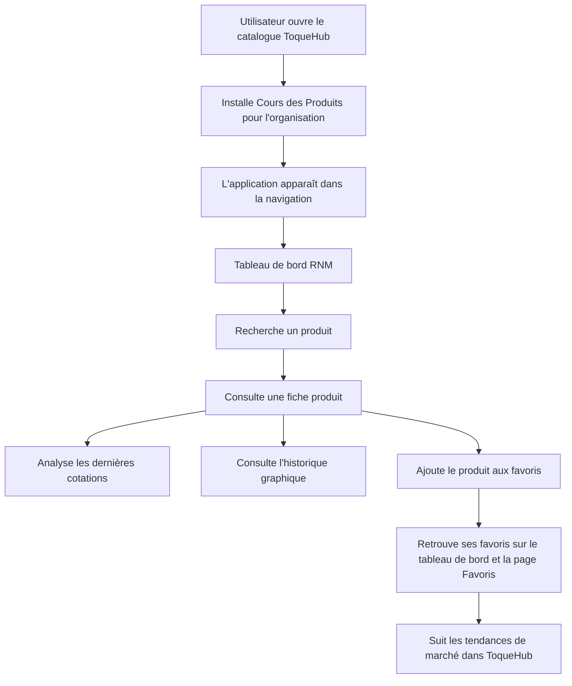
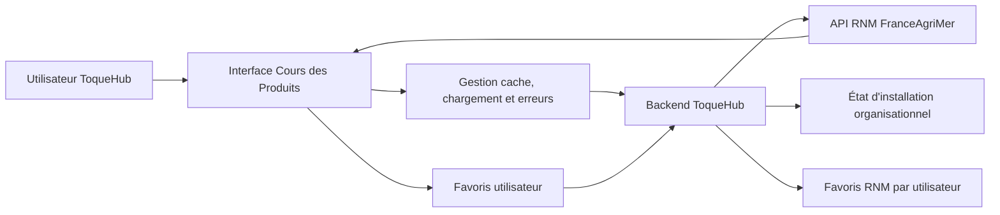

# Plan – Application ToqueHub “📈 Cours des Produits”

## 1. Objectif produit

Créer une application officielle ToqueHub nommée **Cours des Produits**, destinée à devenir le centre de veille économique alimentaire de ToqueHub.

Elle permettra aux chefs, économes, responsables achats et gestionnaires de consulter en temps réel les cours alimentaires issus du RNM FranceAgriMer, sans importer ni dupliquer les données RNM dans les référentiels métier ToqueHub.

L’application devra être moderne, premium, responsive, cohérente avec l’écosystème existant, et préparée pour de futures intégrations avec les modules Stocks, Recettes, Production et Achats.

---

## 2. Principes retenus

### Source de données

- Les données RNM restent fournies par l’API externe FranceAgriMer déjà déployée.
- ToqueHub ne stocke pas les produits, catégories, marchés, prix ou cotations RNM en base dans cette V1.
- Les données RNM sont récupérées en temps réel.
- Les appels RNM passent par le **backend ToqueHub comme proxy** afin de centraliser :
  - la configuration de l’URL RNM,
  - la gestion des erreurs,
  - les délais d’attente,
  - les réponses normalisées,
  - la sécurité côté frontend,
  - l’évolutivité future.

### Favoris

- Les favoris sont actifs dès la V1.
- Les favoris sont **persistés par utilisateur ToqueHub**.
- Seuls les identifiants strictement nécessaires au suivi des produits RNM favoris sont conservés.
- Les cours, cotations, catégories, marchés et historiques RNM ne sont pas stockés dans ToqueHub.
- Les favoris restent propres à chaque utilisateur.

### Installation

- L’application est installée **au niveau de l’organisation**, comme les autres applications ToqueHub.
- Une fois installée, elle devient visible dans la navigation de l’organisation.
- La désinstallation est prévue.
- La désinstallation retire l’application de l’interface mais **conserve les favoris utilisateurs** pour permettre une réactivation ultérieure sans perte.

### Graphiques

- Les graphiques utilisent une solution graphique alignée avec **Material UI**.
- Les visualisations doivent être modernes, lisibles, responsive et adaptées au suivi de prix dans le temps.

---

## 3. Catalogue ToqueHub

Ajouter une nouvelle application officielle au catalogue.

### Informations catalogue

- **Nom :** Cours des Produits
- **Icône :** 📈
- **Description :** Suivez les cours du marché alimentaire FranceAgriMer et analysez l’évolution des prix de milliers de produits.
- **Statut :** Disponible
- **Bouton :** Installer

### Comportement

- Avant installation, l’application apparaît dans le catalogue comme disponible.
- Le bouton d’installation déclenche l’activation pour l’organisation.
- Après installation :
  - l’application apparaît dans la navigation,
  - le bouton catalogue devient un accès à l’application,
  - l’état installé est visible.
- En cas de désinstallation :
  - l’entrée disparaît de la navigation métier,
  - les favoris utilisateurs sont conservés,
  - les données RNM ne sont jamais supprimées côté ToqueHub puisqu’elles ne sont pas stockées.

---

## 4. Navigation de l’application

Une fois installée, l’application ajoute une section dédiée :

```text
Cours des Produits
├── Tableau de bord
├── Produits
├── Historique
├── Favoris
└── À propos
```

### Règles de navigation

- La navigation doit respecter le style ToqueHub existant.
- Les pages doivent être accessibles uniquement lorsque l’application est installée.
- Aucune page ne doit être vide.
- Chaque page doit gérer :
  - chargement,
  - erreur,
  - absence de résultats,
  - état filtré sans résultat,
  - affichage mobile,
  - affichage desktop.

---

## 5. Tableau de bord

Créer une page d’accueil moderne et premium.

### En-tête

- **Titre :** Cours des Produits
- **Sous-titre :** Analysez les tendances du marché alimentaire en temps réel.

### Recherche principale

Afficher immédiatement un champ de recherche central.

- **Placeholder :** Rechercher un produit…
- Recherche instantanée.
- Exemples suggérés :
  - Tomate
  - Carotte
  - Cabillaud
  - Poulet
  - Farine
  - Beurre

### Cartes statistiques

Afficher quatre cartes principales :

1. Nombre de produits disponibles
2. Nombre de secteurs
3. Nombre de marchés
4. Date de dernière cotation disponible

Ces données sont calculées à partir des réponses RNM disponibles, sans persistance locale des données RNM.

### Top variations

Créer deux cartes :

#### Top hausses

Afficher :

- produit,
- variation,
- prix moyen actuel.

#### Top baisses

Afficher :

- produit,
- variation,
- prix moyen actuel.

Les variations doivent être visuellement différenciées :

- hausse en tonalité positive,
- baisse en tonalité négative,
- stable en tonalité neutre.

### Produits favoris

Afficher les produits suivis par l’utilisateur.

Si aucun favori :

- afficher un état vide travaillé,
- texte :

> Ajoutez vos premiers produits favoris pour suivre facilement leurs évolutions.

---

## 6. Catalogue Produits RNM

Créer une page dédiée à la consultation des produits RNM.

### Données

Utiliser la liste produits RNM exposée par l’API externe via le proxy ToqueHub.

### Affichage

Afficher les produits sous forme de cartes modernes.

Chaque carte doit afficher :

- nom,
- catégorie,
- secteur,
- dernière cotation,
- variation récente,
- indication favori si le produit est suivi.

### Filtres

Prévoir :

- recherche,
- secteur,
- catégorie.

### Pagination

- Respecter la pagination fournie par l’API RNM.
- Afficher des contrôles de pagination clairs.
- Conserver les filtres lors du changement de page.
- Afficher un état vide lorsqu’aucun produit ne correspond aux filtres.

### Interaction

Au clic sur une carte produit :

- ouvrir la fiche produit RNM correspondante,
- charger les informations détaillées en temps réel,
- proposer l’ajout ou le retrait des favoris.

---

## 7. Fiche Produit

Créer une fiche détaillée pour chaque produit RNM.

### Informations principales

Afficher :

- nom du produit,
- catégorie,
- secteur,
- date de dernière cotation,
- nombre de variétés,
- statut favori.

### Actions

- Ajouter aux favoris.
- Retirer des favoris.
- Retour au catalogue.
- Accéder à l’historique filtré du produit.

### Dernières cotations

Afficher un tableau avec les colonnes :

- variété,
- marché,
- code marché,
- stade,
- prix moyen,
- prix minimum,
- prix maximum,
- variation,
- date.

### Mise en évidence

Les lignes doivent distinguer :

- hausse,
- baisse,
- stable.

Le tableau doit rester lisible sur mobile, avec une présentation adaptée lorsque l’espace est réduit.

---

## 8. Historique des prix sur la fiche produit

Ajouter une section principale dans la fiche produit.

### Visualisation

Créer un graphique moderne affichant :

- prix moyen dans le temps.

### Périodes disponibles

Prévoir les périodes :

- 7 jours,
- 30 jours,
- 90 jours,
- 1 an,
- historique complet.

### Filtres disponibles

- marché,
- stade commercial.

### Comportement

- Le graphique se met à jour selon la période et les filtres.
- Les données sont récupérées en temps réel via le proxy ToqueHub.
- Les états de chargement et d’erreur sont intégrés dans la zone graphique.
- Si aucune donnée historique n’est disponible, afficher un état vide contextualisé.

---

## 9. Historique global

Créer une page dédiée à l’analyse globale des prix RNM.

### Filtres

Prévoir :

- produit,
- marché,
- stade,
- date début,
- date fin.

### Colonnes

Afficher :

- date,
- produit,
- marché,
- prix moyen,
- variation,
- stade.

### Pagination

- Pagination complète.
- Respect des limites de l’API RNM.
- Conservation des filtres lors de la navigation entre pages.

### Usage attendu

Cette page doit servir d’outil d’analyse transversal pour suivre les tendances de marché sans passer obligatoirement par une fiche produit.

---

## 10. Favoris

Créer une page dédiée aux produits RNM suivis par l’utilisateur.

### Fonctionnalités

- Ajouter un produit aux favoris depuis :
  - le catalogue produits,
  - la fiche produit,
  - les zones de recherche.
- Retirer un produit des favoris depuis :
  - la fiche produit,
  - la page Favoris,
  - le tableau de bord.
- Consulter les favoris.
- Afficher les dernières informations connues en temps réel depuis RNM.

### Persistance

- Les favoris sont liés à l’utilisateur ToqueHub.
- Les favoris sont conservés même si l’application est désinstallée.
- Les favoris ne stockent pas les prix ni les cotations RNM.

### État vide

Si aucun favori :

> Ajoutez vos premiers produits favoris pour suivre facilement leurs évolutions.

Ajouter une présentation visuelle premium avec suggestions ou exemples :

- Tomate
- Carotte
- Cabillaud
- Farine
- Beurre

---

## 11. Page À propos

Créer une page explicative.

### Contenu

Présenter :

- le rôle de l’application,
- la source RNM FranceAgriMer,
- la logique temps réel,
- l’absence de stockage des données RNM dans ToqueHub,
- les limites de disponibilité liées à l’API externe,
- la vision future d’intégration avec l’écosystème ToqueHub.

### Message produit

Positionner l’application comme un outil de veille économique alimentaire pour :

- chefs,
- économes,
- responsables achats,
- gestionnaires,
- directions de restauration.

---

## 12. Intégration Core ToqueHub

### À respecter strictement

L’application ne doit pas créer de données métier ToqueHub telles que :

- produits ToqueHub,
- catégories ToqueHub,
- fournisseurs,
- stocks,
- mouvements,
- inventaires.

### Données consommées

L’application consomme :

- l’identité utilisateur,
- l’organisation,
- l’état d’installation des applications,
- les favoris RNM de l’utilisateur,
- les données RNM externes via le proxy.

### Données créées en V1

Uniquement :

- état d’installation organisationnel de l’application,
- favoris RNM par utilisateur.

Aucune donnée RNM de marché ne doit être importée dans les référentiels ToqueHub.

---

## 13. Proxy RNM côté backend ToqueHub

Créer une couche d’intégration backend dédiée à RNM.

### Responsabilités

- Relayer les requêtes vers l’API RNM externe.
- Normaliser les réponses utiles au frontend.
- Appliquer une gestion d’erreur homogène.
- Gérer les délais d’attente.
- Préparer une configuration centralisée de l’URL RNM.
- Éviter que le frontend dépende directement de l’API externe.
- Préparer une évolution future vers d’autres fournisseurs de cours de marché si nécessaire.

### Endpoints fonctionnels à couvrir

Le proxy doit permettre au frontend d’accéder aux usages suivants :

- liste des produits,
- détail d’un produit,
- historique des prix,
- filtres marché/stade/date,
- pagination,
- éventuellement structure hiérarchique ou exports si utile pour les statistiques.

---

## 14. React Query

Utiliser **React Query** pour toute la consommation des données RNM et des favoris.

### Usages attendus

- cache,
- refetch intelligent,
- gestion des chargements,
- gestion des erreurs,
- rafraîchissement contrôlé,
- invalidation après ajout ou retrait de favoris,
- conservation fluide des données pendant les changements de filtres ou pagination.

### Comportement

- Les recherches doivent rester réactives.
- Les pages ne doivent pas clignoter inutilement.
- Les erreurs doivent être affichées proprement sans casser l’interface.
- Les données RNM restent considérées comme fraîches sur des durées raisonnables, adaptées à une consultation de cours de marché.

---

## 15. Gestion des erreurs

Si l’API RNM est indisponible, afficher un message élégant :

### Titre

> Données temporairement indisponibles

### Texte

> Impossible de récupérer les données RNM actuellement.  
> Veuillez réessayer ultérieurement.

### Comportement attendu

- Le message doit être contextualisé dans la page concernée.
- Le reste de ToqueHub doit continuer à fonctionner.
- Les favoris restent consultables comme liste, même si les détails RNM ne peuvent pas être enrichis temporairement.
- Prévoir une action de réessai.
- Différencier les erreurs :
  - indisponibilité RNM,
  - absence de données,
  - recherche sans résultat,
  - erreur d’autorisation ToqueHub,
  - erreur réseau.

---

## 16. Design UX/UI

### Contraintes

- Material UI
- Framer Motion
- Responsive mobile
- Responsive desktop
- Mode clair
- Préparation mode sombre futur
- Graphiques modernes alignés MUI
- Cartes premium
- Aucune page vide
- Animations discrètes

### Inspirations

- TradingView
- Google Finance
- Linear
- Vercel
- Supabase

### Direction visuelle

- Interface claire, analytique et premium.
- Cartes statistiques sobres.
- Courbes lisibles.
- Variations de prix immédiatement compréhensibles.
- États vides travaillés.
- Micro-animations au survol et lors des transitions.
- Cohérence avec le style ToqueHub existant.

### Responsive

Sur desktop :

- tableaux complets,
- graphiques larges,
- filtres visibles,
- navigation fluide.

Sur mobile :

- cartes empilées,
- filtres condensés,
- tableaux adaptés,
- actions principales accessibles,
- lecture prioritaire des prix et variations.

---

## 17. Préparation futures intégrations

### Lien produit ToqueHub ↔ produit RNM

Prévoir une architecture permettant plus tard de relier :

- un produit ToqueHub,
- un produit RNM.

Exemple :

- Produit ToqueHub : Tomate ronde
- Produit RNM : Tomate

### Résultat futur attendu

Afficher dans une fiche produit ToqueHub :

- prix RNM actuel,
- variation 30 jours,
- variation 90 jours,
- tendance marché.

### Module Recettes

Préparer la future exploitation des cours RNM par les recettes.

Exemples futurs :

- coût matière théorique,
- évolution du coût matière,
- impact des variations de marché.

### Modules futurs

L’application doit pouvoir alimenter plus tard :

- Stocks,
- Recettes,
- Production,
- Achats.

Cette préparation doit rester non intrusive en V1 : aucune intégration métier automatique ne doit modifier les données existantes.

---

## 18. Sécurité et droits

### Accès

- Les utilisateurs connectés d’une organisation ayant installé l’application peuvent consulter l’application.
- Les favoris restent personnels.
- L’installation et la désinstallation suivent les règles d’administration ToqueHub existantes.

### Protection

- Les appels RNM passent par le backend ToqueHub.
- Les données utilisateur restent protégées par l’authentification ToqueHub.
- Les favoris ne sont accessibles qu’à leur propriétaire.

---

## 19. Tests et validation

### Scénarios à valider

- Application visible dans le catalogue.
- Installation par organisation.
- Apparition dans la navigation après installation.
- Désinstallation retirant l’application de la navigation.
- Conservation des favoris après désinstallation.
- Réactivation retrouvant les favoris.
- Recherche produits.
- Filtres secteur et catégorie.
- Pagination produits.
- Ouverture fiche produit.
- Affichage des dernières cotations.
- Graphique historique avec périodes.
- Historique global filtré.
- Ajout favori.
- Retrait favori.
- Favoris propres à chaque utilisateur.
- API RNM indisponible.
- Aucun résultat.
- Affichage mobile.
- Affichage desktop.

### Qualité attendue

- Pas de page vide.
- Pas d’import de données RNM en base ToqueHub.
- Pas de création de produits, catégories, fournisseurs ou stocks ToqueHub.
- Expérience fluide.
- États de chargement cohérents.
- Erreurs élégantes.
- Interface homogène avec ToqueHub.

---

## 20. Parcours utilisateur cible



---

## 21. Architecture fonctionnelle cible



---

## 22. Priorités de réalisation

### Phase 1 – Fondation

- Ajouter l’application au catalogue.
- Gérer installation et désinstallation organisationnelles.
- Ajouter la navigation complète.
- Mettre en place le proxy RNM backend.
- Mettre en place React Query.
- Mettre en place la persistance des favoris utilisateur.

### Phase 2 – Consultation RNM

- Tableau de bord.
- Recherche principale.
- Catalogue produits.
- Filtres.
- Pagination.
- Gestion des états de chargement, vide et erreur.

### Phase 3 – Analyse produit

- Fiche produit.
- Dernières cotations.
- Mise en évidence hausse, baisse, stable.
- Graphique historique avec périodes.
- Filtres marché et stade.

### Phase 4 – Historique global et favoris

- Page historique global.
- Filtres avancés.
- Pagination complète.
- Page favoris.
- États vides premium.
- Conservation des favoris après désinstallation.

### Phase 5 – Finition UX

- Responsive mobile.
- Responsive desktop.
- Animations Framer Motion.
- Cartes premium.
- Harmonisation Material UI.
- Préparation mode sombre futur.
- Page À propos.
- Validation complète des scénarios.
