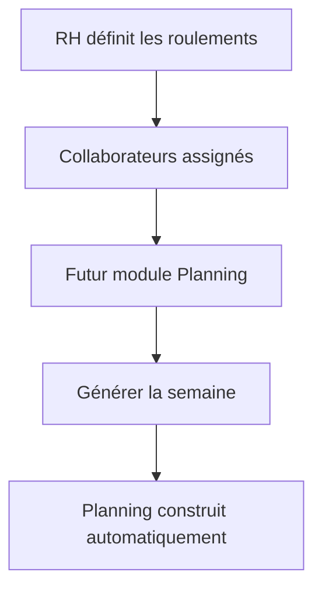
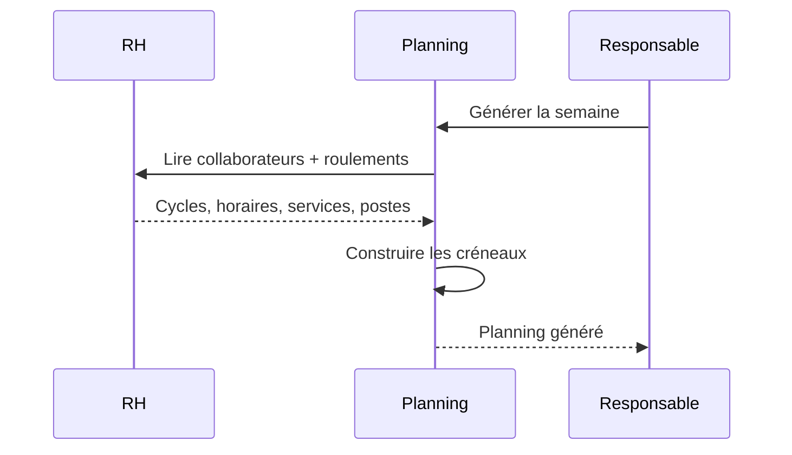

# Plan – Extension RH · Gestion des Roulements

## 1. Objectif

Ajouter au module **RH** une fonctionnalité stratégique :

**🔄 Roulements**

Les roulements définissent les cycles de travail standards des collaborateurs. Ils deviennent une brique de référence du module RH et serviront de fondation au futur module **Planning**.

Le futur Planning ne devra pas recréer ces informations : il lira directement les roulements, collaborateurs, services et postes du référentiel RH.

---

## 2. Vision produit

Le module RH devient le référentiel organisationnel complet de l’établissement.

Il gère désormais :

- Collaborateurs
- Services
- Postes
- Roulements

Les roulements décrivent l’organisation de travail standard : horaires, repos, pauses, durée hebdomadaire, cycles multi-semaines et affectations collaborateurs.

Objectif futur :



---

## 3. Navigation RH

Ajouter un nouvel élément au menu RH :

```text
RH
├── Tableau de bord
├── Collaborateurs
├── Services
├── Postes
├── Roulements
└── Organigramme
```

Le menu peut conserver l’organigramme si déjà présent. Les roulements doivent être visibles comme une section RH de premier niveau.

---

## 4. Page Roulements

### Titre

**Roulements**

### Sous-titre

**Définissez les cycles de travail réutilisables de votre établissement.**

### Liste des roulements

Afficher un tableau moderne et responsive.

Colonnes :

- Nom
- Service
- Cycle
- Durée hebdomadaire
- Collaborateurs assignés
- Statut
- Actions

### Actions

Selon les droits RH existants :

- Créer
- Modifier
- Archiver
- Voir le détail
- Assigner des collaborateurs
- Retirer des collaborateurs

Lecture large, écriture réservée comme le reste du module RH.

---

## 5. Création de roulement

Le formulaire de création/modification doit être structuré en sections.

## 5.1 Informations générales

Champs :

- Nom
- Service
- Description

### Service

Décision validée : le service est obligatoire ou peut prendre une valeur équivalente à **Tous services**.

Comportement attendu :

- Un roulement peut être rattaché à un service précis.
- Un roulement peut aussi être défini comme transverse via **Tous services**.
- Les roulements archivés ne doivent plus être proposés pour les nouvelles assignations.

### Exemples de noms

- Cuisine matin
- Cuisine soir
- Pâtisserie
- Week-end
- Cuisine centrale
- Agent polyvalent
- Administration

---

## 6. Roulements exemples

Décision validée : créer automatiquement des roulements exemples.

Ces roulements doivent être créés avec les données de départ RH ou lors de l’installation/mise à jour du module RH.

Exemples recommandés :

1. **Cuisine matin**
   - Service : Cuisine
   - Cycle : 1 semaine
   - Horaires types : matin

2. **Cuisine soir**
   - Service : Cuisine
   - Cycle : 1 semaine
   - Horaires types : soir

3. **Pâtisserie**
   - Service : Pâtisserie
   - Cycle : 1 semaine

4. **Week-end**
   - Service : Tous services
   - Cycle : 1 semaine

5. **Cuisine centrale**
   - Service : Cuisine
   - Cycle : 1 semaine

6. **Agent polyvalent**
   - Service : Tous services
   - Cycle : 1 semaine

7. **Administration**
   - Service : Administration
   - Cycle : 1 semaine

Ces exemples doivent rester modifiables et archivables.

---

## 7. Définition du cycle

## 7.1 Cycles disponibles

Décision validée : livrer dès la V1 des cycles de **1 à 4 semaines**.

Options :

- Cycle sur 1 semaine
- Cycle sur 2 semaines
- Cycle sur 3 semaines
- Cycle sur 4 semaines

Le modèle doit rester compatible avec un cycle personnalisé futur.

## 7.2 Structure du cycle

Chaque roulement contient une ou plusieurs semaines.

Pour chaque semaine :

- Semaine A
- Semaine B
- Semaine C
- Semaine D

Selon la durée du cycle choisie.

Chaque semaine contient les jours :

- Lundi
- Mardi
- Mercredi
- Jeudi
- Vendredi
- Samedi
- Dimanche

## 7.3 Configuration d’une journée

Chaque journée peut être marquée :

- Travail
- Repos

Si la journée est en mode **Travail**, afficher :

- Heure début
- Heure fin
- Pause en minutes
- Durée calculée

Décision validée : la pause est représentée en minutes.

Exemple :

```text
Lundi
06h00 - 14h00
Pause : 30 min
Durée calculée : 7h30
```

Si la journée est en mode **Repos**, afficher clairement :

```text
Mercredi
Repos
```

---

## 8. Travail de nuit

Décision validée : les roulements doivent autoriser les horaires qui passent minuit.

Exemple :

```text
Samedi
20h00 - 04h00
Pause : 30 min
Durée calculée : 7h30
```

Règles :

- Si l’heure de fin est antérieure à l’heure de début, la fin est considérée comme étant le lendemain.
- La durée calculée doit rester correcte.
- L’interface doit signaler clairement que le créneau se termine le lendemain.
- Les calculs hebdomadaires doivent intégrer correctement ces horaires de nuit.

---

## 9. Calculs automatiques

Pour chaque roulement, calculer automatiquement :

- Heures hebdomadaires
- Nombre de jours travaillés
- Nombre de jours de repos
- Amplitude moyenne

### Cycle multi-semaines

Pour les cycles de 2 à 4 semaines :

- Calculer les métriques par semaine.
- Calculer une moyenne sur le cycle.
- Afficher clairement la durée hebdomadaire moyenne.

### Définitions

- **Heures hebdomadaires** : total des durées travaillées de la semaine, pauses déduites.
- **Jours travaillés** : nombre de jours marqués Travail.
- **Jours de repos** : nombre de jours marqués Repos.
- **Amplitude moyenne** : moyenne des amplitudes journalières des jours travaillés, avant ou après pause selon le choix produit affiché. En V1, afficher l’amplitude comme durée de présence, et la durée travaillée comme durée pause déduite.

---

## 10. Visualisation calendrier

Créer une vue calendrier simple et élégante.

Objectif :

Comprendre immédiatement le fonctionnement du roulement.

### Affichage

Afficher :

- Lundi → Dimanche
- Horaires
- Repos
- Heures totales
- Pause
- Indication “fin le lendemain” pour les horaires de nuit

### Cycles multi-semaines

Afficher une navigation ou segmentation :

- Semaine A
- Semaine B
- Semaine C
- Semaine D

Chaque semaine doit être lisible indépendamment.

---

## 11. Assignation aux collaborateurs

## 11.1 Règle métier

Un collaborateur peut avoir :

- 0 roulement
- 1 roulement actif

Un collaborateur ne peut pas avoir plusieurs roulements actifs simultanément.

## 11.2 Niveau d’assignation

Point restant à figer si besoin pendant l’implémentation : l’assignation peut être simple actuelle ou datée.  
Recommandation produit : utiliser une affectation datée avec date de début optionnelle et date de fin optionnelle afin de préparer le futur Planning et conserver l’historique.

Comportement recommandé :

- Une affectation active est une affectation sans date de fin.
- Une nouvelle affectation clôture l’ancienne.
- L’historique permet de savoir quel roulement était applicable à une période donnée.

## 11.3 Depuis un roulement

Afficher :

- Collaborateurs associés

Permettre :

- Ajouter un collaborateur
- Retirer un collaborateur

Filtrer les collaborateurs disponibles :

- Collaborateurs non archivés
- Collaborateurs sans roulement actif
- Collaborateurs compatibles avec le service du roulement
- Pour **Tous services**, tout collaborateur actif peut être proposé

## 11.4 Depuis la fiche collaborateur

Ajouter une section :

**Organisation de travail**

Afficher :

- Service
- Poste
- Roulement

Permettre :

- Sélectionner un roulement existant
- Retirer le roulement actif

Exemple :

```text
Paul Breton
Service : Cuisine
Poste : Chef de cuisine
Roulement : Cuisine matin standard
```

---

## 12. Archivage des roulements

Les roulements ne doivent jamais être supprimés définitivement.

Action :

- Archiver

Décision validée : conserver les assignations existantes mais bloquer les nouvelles assignations.

Comportement :

- Un roulement archivé reste visible dans les historiques et sur les anciennes relations.
- Il n’est plus proposé pour une nouvelle assignation.
- Les collaborateurs déjà liés conservent leur référence historique.
- Les anciennes planifications futures pourront continuer à résoudre le roulement d’origine.

---

## 13. Historique

Étendre l’historique RH pour tracer les événements liés aux roulements.

Événements recommandés :

- Création d’un roulement
- Modification d’un roulement
- Archivage d’un roulement
- Assignation d’un collaborateur
- Retrait d’un collaborateur
- Changement de roulement d’un collaborateur

L’historique collaborateur doit afficher les changements de roulement dans la fiche collaborateur.

---

## 14. Dashboard RH

Ajouter de nouvelles statistiques au tableau de bord RH.

Cartes supplémentaires :

- **Roulements actifs**
- **Collaborateurs avec roulement**
- **Collaborateurs sans roulement**
- **Durée hebdomadaire moyenne**

Les cartes existantes restent :

- Collaborateurs
- Services
- Postes
- Collaborateurs avec compte ToqueHub

Le dashboard doit rester lisible et responsive.

---

## 15. Intégration avec la fiche collaborateur

La fiche collaborateur doit être enrichie.

Ajouter une section :

**Organisation de travail**

Contenu :

- Service
- Poste
- Roulement actif
- Heures hebdomadaires du roulement
- Jours travaillés / repos
- Service du roulement

Actions selon droits :

- Modifier le roulement
- Retirer le roulement

La section ne remplace pas les informations professionnelles existantes : elle les complète.

---

## 16. Préparation du futur module Planning

Le modèle doit exposer des informations réutilisables par Planning.

Le futur module Planning devra pouvoir lire :

- Collaborateurs
- Services
- Postes
- Roulements
- Semaines du cycle
- Jours travaillés/repos
- Horaires
- Assignations collaborateur ↔ roulement
- Dates d’application si l’assignation datée est retenue

Objectif futur :



---

## 17. API attendue

Ajouter les capacités suivantes au module RH.

### Roulements

- Lister les roulements
- Lire un roulement
- Créer un roulement
- Modifier un roulement
- Archiver un roulement

### Assignations

- Lister les collaborateurs assignés à un roulement
- Assigner un collaborateur à un roulement
- Retirer un collaborateur d’un roulement
- Modifier le roulement actif depuis la fiche collaborateur

### Dashboard

- Inclure les statistiques de roulements dans le dashboard RH.

### Planning futur

Prévoir des réponses suffisamment structurées pour être consommées sans ressaisie par le futur module Planning.

---

## 18. Design

Inspirations :

- Skello
- Combo
- Factorial
- Lucca
- Personio

Contraintes :

- Material UI
- Responsive
- Framer Motion
- Cartes modernes
- Vue calendrier élégante
- Calculs automatiques
- États vides travaillés
- Mode clair
- Mode sombre futur

### UX attendue

- Les horaires doivent être rapides à saisir.
- Les jours de repos doivent être très visibles.
- Les totaux doivent se recalculer immédiatement.
- Les cycles multi-semaines doivent rester compréhensibles.
- L’assignation collaborateur doit être simple et sécurisée.
- La vue calendrier doit permettre de comprendre le roulement sans lire le formulaire.

---

## 19. Critères d’acceptation

L’extension Roulements est conforme si :

- Le menu RH contient **Roulements**.
- Une page Roulements existe avec titre et sous-titre conformes.
- Les roulements sont listés avec les colonnes attendues.
- Un roulement peut être créé avec nom, service ou Tous services, description et cycle.
- Les cycles 1 à 4 semaines sont disponibles.
- Chaque jour peut être Travail ou Repos.
- Les horaires jour par jour sont configurables.
- Les pauses sont saisies en minutes.
- Les horaires passant minuit sont autorisés et correctement calculés.
- Les totaux automatiques sont affichés.
- Une vue calendrier permet de comprendre le roulement.
- Des roulements exemples sont créés automatiquement.
- Un collaborateur peut avoir 0 ou 1 roulement actif.
- Un roulement peut être assigné et retiré depuis la page roulement.
- Le roulement est visible et modifiable depuis la fiche collaborateur.
- Les roulements archivés ne sont plus proposés en nouvelle assignation.
- Les assignations existantes et historiques sont conservées.
- Le dashboard RH affiche les statistiques roulements.
- Le modèle est exploitable par le futur module Planning.
- L’interface respecte Material UI, responsive, Framer Motion, cartes modernes et états vides travaillés.
