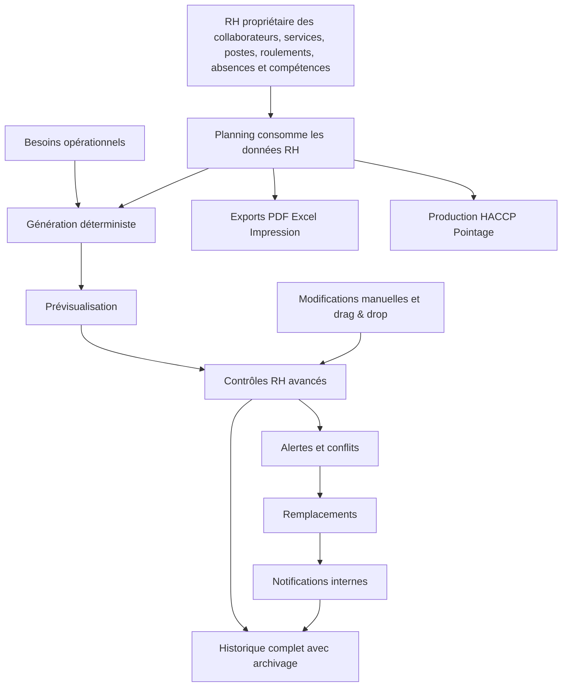
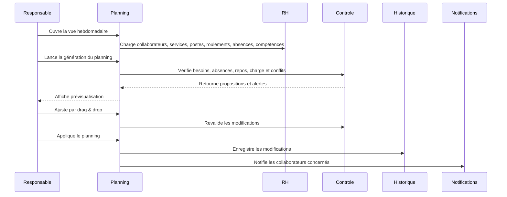

# Plan complet – Module **Planning** ToqueHub

## 1. Objectif général

Créer le module **Planning** comme centre opérationnel de ToqueHub pour gérer l’activité quotidienne, hebdomadaire et mensuelle des équipes.

Le module doit couvrir :

- plannings journaliers, hebdomadaires et mensuels ;
- affectations de collaborateurs ;
- absences validées issues du périmètre RH ;
- remplacements ;
- modèles de planning ;
- besoins opérationnels ;
- génération automatique déterministe ;
- alertes de couverture et de conformité ;
- charge de travail ;
- vues collaborateur et service ;
- notifications internes ;
- historique complet avec archivage par période ;
- exports PDF, Excel et impression.

Le module doit rester aligné avec l’architecture modulaire ToqueHub et ne jamais recréer les données déjà détenues par le Core ou la RH.

---

## 2. Principes d’architecture validés

### 2.1 Relation avec RH

Le Planning consomme les données RH et ne les duplique pas.

Les données suivantes restent propriétaires du module RH :

- collaborateurs ;
- services ;
- postes ;
- roulements ;
- absences ;
- compétences.

Le module Planning doit uniquement référencer ces données pour :

- afficher les collaborateurs ;
- générer les affectations ;
- calculer la couverture ;
- détecter les conflits ;
- proposer des remplacements ;
- produire les vues planning.

### 2.2 Absences

Les absences sont propriétaires du module RH.

Le Planning doit :

- afficher les absences RH ;
- tenir compte uniquement des absences pertinentes dans ses calculs ;
- appliquer le workflow complet de validation ;
- considérer les absences validées comme bloquantes pour la planification ;
- afficher les absences en attente ou refusées avec un statut distinct si utile ;
- déclencher les alertes de sous-effectif et de remplacement lorsque l’absence validée impacte un créneau.

### 2.3 Compétences

Les compétences doivent être ajoutées côté RH.

Le Planning doit les consommer pour les remplacements, sans créer de référentiel parallèle.

Elles serviront notamment à classer les propositions de remplaçants selon :

- service habituel ;
- poste ;
- compétences ;
- disponibilité ;
- charge horaire ;
- absence de conflit.

### 2.4 Multi-site

Le planning doit être **adaptatif par site** :

- si l’organisation fonctionne avec un seul site, l’interface reste simple ;
- si plusieurs sites existent, le module propose des filtres par site ;
- une vue consolidée globale reste disponible ;
- les besoins, affectations, alertes et exports doivent pouvoir être filtrés par site.

### 2.5 Pré-requis RH

Le module Planning peut être visible même si RH n’est pas encore configuré.

Dans ce cas :

- aucune page ne doit être vide ;
- une vue d’accueil explique que RH est requis ;
- l’utilisateur est guidé vers l’installation ou la configuration RH ;
- le module ne doit pas créer de collaborateurs, services, postes ou roulements de substitution.

---

## 3. Stratégie de livraison

La stratégie retenue est : **version exhaustive**.

Le plan doit donc inclure dès cette version :

- toutes les vues principales ;
- le tableau de bord ;
- les affectations ;
- les absences issues de RH ;
- les remplacements ;
- les modèles ;
- les besoins opérationnels ;
- la génération automatique ;
- les contrôles RH avancés ;
- les notifications internes ;
- les exports ;
- l’historique complet ;
- l’intégration au Dashboard ToqueHub ;
- la migration Prisma complète.

---

## 4. Navigation du module

Le module **Planning** doit contenir les entrées suivantes :

```text
Planning
├── Tableau de bord
├── Planning journalier
├── Planning hebdomadaire
├── Planning mensuel
├── Affectations
├── Absences
├── Remplacements
├── Modèles
└── Besoins opérationnels
```

Chaque section doit proposer un contenu réel, même en absence de données :

- état d’accueil ;
- explication ;
- action recommandée ;
- lien vers RH si nécessaire ;
- exemples visuels non persistés si utile.

---

## 5. Tableau de bord Planning

### 5.1 En-tête

Titre :

> Planning

Sous-titre :

> Vue globale de l’activité et des effectifs.

### 5.2 Cartes statistiques

Afficher au minimum :

- collaborateurs prévus aujourd’hui ;
- collaborateurs absents ;
- services couverts ;
- services en sous-effectif ;
- remplacements nécessaires ;
- heures planifiées cette semaine.

### 5.3 Alertes

Afficher les alertes suivantes :

- absences non remplacées ;
- services en sous-effectif ;
- conflits horaires ;
- collaborateurs sans planning ;
- collaborateurs sans roulement ;
- dépassements de règles RH ;
- collaborateurs affectés pendant une absence validée ;
- créneaux avec besoin opérationnel non couvert.

### 5.4 Priorisation des alertes

Les alertes doivent être lisibles par niveau :

- critique ;
- attention ;
- information.

Les alertes critiques doivent concerner notamment :

- absence validée non remplacée ;
- service essentiel non couvert ;
- conflit horaire bloquant ;
- affectation d’un collaborateur indisponible.

---

## 6. Planning journalier

### 6.1 Objectif

Fournir une vue opérationnelle de la journée, de préférence utilisée par les responsables de service.

### 6.2 Plage horaire

Afficher :

> 06h00 → 22h00

Cette plage doit être le comportement par défaut, avec possibilité future d’adaptation pour les établissements ayant des horaires étendus.

### 6.3 Organisation par service

Afficher les services issus de RH, notamment :

- Cuisine ;
- Pâtisserie ;
- Magasin ;
- Administration ;
- Entretien.

Ces services ne doivent pas être recréés par le Planning.

### 6.4 Données affichées par collaborateur

Pour chaque collaborateur planifié :

- nom ;
- poste ;
- horaires ;
- service ;
- statut ;
- indicateur d’absence ou de remplacement si applicable ;
- indicateur de conflit si applicable.

### 6.5 Actions

Le responsable ou l’administrateur peut :

- ajouter une affectation ;
- modifier une affectation ;
- déplacer une affectation ;
- supprimer une affectation ;
- transformer une affectation en remplacement ;
- consulter l’historique du créneau.

### 6.6 Drag & Drop

Le drag & drop est obligatoire.

Il doit permettre :

- déplacement d’un collaborateur vers un autre créneau ;
- déplacement vers un autre service ;
- ajustement rapide dans la journée ;
- déclenchement immédiat des contrôles RH avancés ;
- affichage clair des conflits avant validation.

---

## 7. Planning hebdomadaire

### 7.1 Objectif

La vue hebdomadaire est la vue principale du module.

Elle doit permettre au responsable de piloter la semaine entière.

### 7.2 Colonnes

Afficher :

- lundi ;
- mardi ;
- mercredi ;
- jeudi ;
- vendredi ;
- samedi ;
- dimanche.

### 7.3 Lignes

Afficher les collaborateurs issus de RH.

### 7.4 Informations affichées

Pour chaque journée et collaborateur :

- horaires ;
- service ;
- poste ;
- absence ;
- repos ;
- formation ;
- remplacement ;
- conflit ;
- total d’heures.

### 7.5 Drag & Drop complet

Le drag & drop doit permettre :

- déplacer une affectation d’un jour à l’autre ;
- déplacer une affectation entre collaborateurs ;
- copier ou appliquer un créneau récurrent ;
- ajuster rapidement les services ;
- déclencher les contrôles RH avancés ;
- recalculer les besoins couverts.

### 7.6 Vue de charge hebdomadaire

La vue doit afficher :

- total d’heures planifiées ;
- jours travaillés ;
- jours de repos ;
- absences ;
- dépassements ;
- répartition par service.

---

## 8. Planning mensuel

### 8.1 Objectif

Fournir une vue calendrier synthétique pour anticiper les présences, absences et périodes sensibles.

### 8.2 Informations affichées

Afficher :

- présences ;
- congés ;
- maladies ;
- repos ;
- formations ;
- remplacements ;
- sous-effectifs ;
- périodes couvertes par modèle.

### 8.3 Navigation rapide

Prévoir :

- mois précédent ;
- mois suivant ;
- aujourd’hui.

### 8.4 Usage

La vue mensuelle sert principalement à :

- détecter les semaines à risque ;
- visualiser les absences longues ;
- préparer les remplacements ;
- suivre les congés ;
- vérifier la cohérence des roulements ;
- appliquer des modèles sur une période.

---

## 9. Affectations

### 9.1 Objectif

Permettre d’affecter un collaborateur RH à un service et à un créneau horaire.

Exemple fonctionnel :

```text
Paul Breton
↓
Cuisine
↓
06h00 → 14h00
```

### 9.2 Données d’une affectation

Une affectation doit contenir :

- collaborateur RH ;
- service RH ;
- poste RH ;
- site optionnel ;
- date ;
- heure de début ;
- heure de fin ;
- pause éventuelle ;
- statut ;
- origine ;
- commentaire éventuel.

### 9.3 Origines possibles

Une affectation peut provenir de :

- création manuelle ;
- génération automatique ;
- application d’un modèle ;
- remplacement ;
- ajustement par drag & drop.

### 9.4 Statuts possibles

Prévoir des statuts permettant de distinguer :

- planifié ;
- confirmé ;
- modifié ;
- annulé ;
- remplacé.

---

## 10. Absences

### 10.1 Propriété

Les absences sont gérées par RH.

Le Planning affiche et consomme les absences RH.

### 10.2 Types d’absence

Les types attendus sont :

- congé ;
- RTT ;
- maladie ;
- formation ;
- accident ;
- absence exceptionnelle ;
- repos ;
- autre.

### 10.3 Informations

Une absence doit exposer au Planning :

- collaborateur ;
- date de début ;
- date de fin ;
- motif ;
- commentaire ;
- statut de validation ;
- éventuel validateur ;
- date de validation.

### 10.4 Workflow de validation

Le workflow complet doit prévoir :

- brouillon ou demande ;
- en attente ;
- validée ;
- refusée ;
- annulée.

Seules les absences validées doivent bloquer la planification.

### 10.5 Comportement côté Planning

Le Planning doit :

- afficher les absences sur les vues jour, semaine et mois ;
- empêcher ou alerter fortement une affectation pendant absence validée ;
- déclencher un besoin de remplacement ;
- comptabiliser les absents dans le tableau de bord ;
- historiser les impacts sur le planning.

---

## 11. Remplacements

### 11.1 Objectif

Détecter automatiquement les absences ayant un impact opérationnel et proposer des remplaçants.

### 11.2 Détection automatique

Exemple :

```text
Paul absent
↓
Le système propose :
Marie
Jean
Lucas
```

### 11.3 Critères de proposition

Les remplaçants sont classés selon :

- même service ;
- même poste ;
- compétences RH ;
- disponibilité ;
- absence de conflit ;
- charge horaire actuelle ;
- respect des règles RH avancées ;
- site compatible si multi-site ;
- historique de remplacement si pertinent.

### 11.4 Actions

L’utilisateur peut :

- accepter une proposition ;
- choisir un autre collaborateur ;
- créer un remplacement manuel ;
- ignorer temporairement l’alerte ;
- consulter pourquoi un collaborateur est proposé ou écarté.

### 11.5 Statuts d’un remplacement

Prévoir :

- à traiter ;
- proposé ;
- accepté ;
- refusé ;
- effectué ;
- annulé.

---

## 12. Modèles de planning

### 12.1 Objectif

Permettre de créer et appliquer rapidement des modèles de planning réutilisables.

### 12.2 Exemples de modèles

Prévoir notamment :

- semaine standard cuisine ;
- week-end ;
- vacances scolaires ;
- période estivale ;
- cuisine centrale.

### 12.3 Contenu d’un modèle

Un modèle doit pouvoir contenir :

- période type ;
- services concernés ;
- créneaux horaires ;
- besoins opérationnels ;
- règles de repos ;
- postes requis ;
- répartition indicative ;
- site optionnel.

### 12.4 Application rapide

Prévoir une action :

> Appliquer modèle

L’application doit :

- prévisualiser les impacts ;
- détecter les conflits ;
- respecter les absences validées ;
- ne pas écraser sans confirmation les affectations existantes ;
- historiser l’application.

---

## 13. Besoins opérationnels

### 13.1 Objectif

Permettre de définir combien de personnes sont nécessaires par service, période et site.

Exemples :

```text
Cuisine
Matin
4 personnes
```

```text
Cuisine
Soir
3 personnes
```

```text
Pâtisserie
2 personnes
```

### 13.2 Données d’un besoin

Un besoin doit définir :

- service RH ;
- site optionnel ;
- période ou créneau ;
- nombre requis ;
- poste requis si nécessaire ;
- compétence requise si nécessaire ;
- priorité ;
- période de validité ;
- commentaire.

### 13.3 Comparaison automatique

Le système compare :

```text
Effectif prévu
vs
Effectif nécessaire
```

### 13.4 Résultats possibles

Afficher :

- couvert ;
- partiellement couvert ;
- sous-effectif ;
- sur-effectif ;
- non planifié.

### 13.5 Utilisation par la génération

La génération automatique doit utiliser les besoins opérationnels pour proposer les affectations.

---

## 14. Génération automatique du planning

### 14.1 Objectif

Créer une fonction stratégique :

> Générer le planning

### 14.2 Sources utilisées

La génération utilise :

- collaborateurs RH ;
- services RH ;
- postes RH ;
- roulements RH ;
- absences RH validées ;
- compétences RH ;
- besoins opérationnels ;
- affectations existantes ;
- modèles applicables ;
- site éventuel.

### 14.3 Niveau d’intelligence validé

Le niveau retenu est :

> Règles métier déterministes

Le système doit appliquer des règles explicites et prévisibles, plutôt qu’un moteur opaque.

### 14.4 Ce que le système propose

Le système propose automatiquement :

- horaires ;
- jours de repos ;
- services ;
- postes ;
- remplacements nécessaires ;
- couverture des besoins ;
- alertes en cas d’impossibilité.

### 14.5 Contrôles pendant génération

La génération doit tenir compte de :

- absences validées ;
- roulements actifs ;
- disponibilités ;
- service principal ;
- poste ;
- compétences ;
- site ;
- charge hebdomadaire ;
- repos minimum ;
- amplitude horaire ;
- équité raisonnable sur week-end et jours sensibles ;
- conflits avec affectations existantes.

### 14.6 Prévisualisation obligatoire

Avant application définitive, l’utilisateur doit voir :

- affectations créées ;
- affectations modifiées ;
- conflits détectés ;
- besoins non couverts ;
- remplacements proposés ;
- alertes RH ;
- impact sur les heures planifiées.

### 14.7 Ajustement manuel

Après génération, l’utilisateur peut ajuster manuellement :

- créneaux ;
- services ;
- collaborateurs ;
- remplacements ;
- modèles appliqués.

Chaque ajustement doit être contrôlé et historisé.

---

## 15. Contrôles RH avancés

Le niveau validé est : **contrôles RH avancés**.

Lors d’une création, modification, génération ou opération drag & drop, le système doit vérifier :

- absence validée ;
- chevauchement horaire ;
- collaborateur inactif ou archivé ;
- service/poste incompatible ;
- compétence manquante si requise ;
- repos minimum ;
- amplitude journalière ;
- charge hebdomadaire ;
- nombre de jours travaillés ;
- repos planifiés ;
- équité sur week-end lorsque possible ;
- cohérence avec roulement ;
- site compatible.

### 15.1 Comportement

Les conflits doivent être classés en :

- bloquants ;
- avertissements forts ;
- informations.

Les conflits critiques doivent empêcher la validation normale, sauf si un mode d’exception administrateur est prévu avec justification et historique.

---

## 16. Vue charge de travail

### 16.1 Objectif

Permettre au responsable de suivre l’équilibre de charge.

### 16.2 Indicateurs

Afficher :

- heures prévues ;
- jours travaillés ;
- jours de repos ;
- absences ;
- remplacements ;
- répartition par service ;
- répartition par site si applicable ;
- dépassements ;
- collaborateurs sous-planifiés ;
- collaborateurs sur-planifiés.

### 16.3 Analyse

La vue doit permettre de détecter :

- surcharge ;
- sous-charge ;
- déséquilibre entre services ;
- manque de repos ;
- répartition inéquitable.

---

## 17. Vue collaborateur

Depuis une fiche collaborateur RH, le Planning doit pouvoir afficher :

- planning semaine ;
- planning mois ;
- absences ;
- roulement ;
- historique ;
- remplacements effectués ;
- charge horaire ;
- alertes éventuelles.

Cette vue ne doit pas recréer la fiche collaborateur.

Elle doit seulement afficher une lecture planning des données rattachées au collaborateur RH.

---

## 18. Vue service

Depuis un service RH, le Planning doit pouvoir afficher :

- tous les collaborateurs affectés ;
- charge horaire ;
- absences ;
- couverture ;
- besoins opérationnels ;
- remplacements ;
- sous-effectifs ;
- vue jour/semaine/mois filtrée.

Cette vue ne doit pas recréer le service.

---

## 19. Notifications internes

### 19.1 Choix validé

Les notifications internes sont activées dès cette version.

### 19.2 Événements notifiés

Prévoir des notifications pour :

- nouvelle affectation ;
- changement de planning ;
- remplacement demandé ;
- remplacement accepté ;
- absence validée ;
- absence refusée ;
- conflit critique détecté ;
- génération appliquée ;
- modèle appliqué.

### 19.3 Destinataires

Les notifications doivent pouvoir cibler :

- collaborateur concerné ;
- responsable ;
- administrateur ;
- utilisateur ayant déclenché l’action ;
- responsable du service concerné si disponible.

### 19.4 Comportement

Les notifications doivent être :

- visibles dans l’application ;
- marquées comme lues/non lues ;
- reliées à l’événement planning ;
- historisées ;
- désactivables ou filtrables dans une évolution future.

---

## 20. Historique

### 20.1 Choix validé

Politique retenue :

> Historique complet avec archivage par période

### 20.2 Événements historisés

Historiser notamment :

- planning créé ;
- affectation ajoutée ;
- affectation modifiée ;
- affectation déplacée ;
- affectation supprimée ;
- absence impactant le planning ;
- remplacement proposé ;
- remplacement effectué ;
- modèle appliqué ;
- génération lancée ;
- génération appliquée ;
- conflit ignoré ;
- export généré ;
- notification créée.

### 20.3 Informations affichées

Pour chaque événement :

- utilisateur ;
- date ;
- action ;
- entité concernée ;
- détail lisible ;
- ancienne valeur si pertinent ;
- nouvelle valeur si pertinent.

### 20.4 Archivage par période

Le système doit permettre de conserver un historique complet tout en préservant les performances :

- filtrage par période ;
- archivage logique ;
- consultation des périodes anciennes ;
- séparation claire entre historique opérationnel courant et historique archivé.

---

## 21. Exports

### 21.1 Formats

Prévoir :

- PDF ;
- Excel ;
- impression.

### 21.2 Périmètres

Exports disponibles pour :

- jour ;
- semaine ;
- mois.

### 21.3 Filtres

Les exports doivent respecter :

- site ;
- service ;
- collaborateur ;
- période ;
- statut ;
- absences ;
- remplacements.

### 21.4 Présentation

Les exports doivent être lisibles pour :

- affichage administratif ;
- affichage opérationnel en cuisine ou service ;
- communication aux équipes ;
- archivage.

---

## 22. Intégration Dashboard ToqueHub

Ajouter une carte :

> Planning

La carte doit afficher :

- présents aujourd’hui ;
- absents ;
- services couverts.

Elle doit proposer le bouton :

> Ouvrir le planning

### 22.1 État sans RH

Si RH n’est pas configuré :

- la carte peut afficher un état de prérequis ;
- un message explique que les collaborateurs et roulements viennent de RH ;
- l’action principale guide vers la configuration RH ou l’ouverture du module Planning avec état d’accueil.

---

## 23. Intégrations futures préparées

### 23.1 Production

Objectif futur :

> Savoir automatiquement qui travaille aujourd’hui.

Le Planning doit exposer une base fiable pour permettre au module Production d’identifier les équipes disponibles.

### 23.2 HACCP

Objectif futur :

> Identifier automatiquement qui est responsable du contrôle qualité.

Le Planning doit permettre de retrouver les collaborateurs présents et éventuellement le responsable désigné sur un créneau.

### 23.3 Pointage

Objectif futur :

```text
Planning prévu
↓
Présence réelle
↓
Écart
```

Le modèle doit préparer la comparaison future entre planifié et réel.

---

## 24. Design et expérience utilisateur

### 24.1 Inspirations

S’inspirer de :

- Skello ;
- Combo ;
- Factorial ;
- Lucca ;
- Personio ;
- Monday ;
- ClickUp Calendar.

### 24.2 Contraintes UI

Respecter :

- Material UI ;
- Framer Motion ;
- responsive mobile ;
- responsive desktop ;
- drag & drop fluide ;
- vue calendrier moderne ;
- animations discrètes ;
- cartes premium ;
- aucune page vide ;
- chargement optimisé.

### 24.3 Principes visuels

Le module doit être :

- clair ;
- dense mais lisible ;
- orienté action ;
- rapide à comprendre ;
- utilisable en contexte opérationnel ;
- cohérent avec les autres modules ToqueHub.

### 24.4 États à prévoir

Chaque écran doit gérer :

- chargement ;
- données vides ;
- prérequis RH manquant ;
- erreur ;
- conflit ;
- succès ;
- sauvegarde en cours ;
- prévisualisation avant application.

---

## 25. Permissions

### 25.1 Choix validé

Modèle retenu :

> Lecture large, édition responsable/admin

### 25.2 Comportement

- Les utilisateurs connectés peuvent consulter les plannings accessibles.
- Les responsables peuvent créer, modifier, déplacer et valider dans leur périmètre.
- Les administrateurs peuvent gérer tout le module.
- Les actions sensibles sont historisées.

### 25.3 Actions réservées

Réserver aux responsables et administrateurs :

- génération automatique ;
- application d’un modèle ;
- modification d’une affectation ;
- suppression d’une affectation ;
- validation d’un remplacement ;
- traitement des conflits critiques ;
- export complet ;
- gestion des besoins opérationnels.

---

## 26. Données et migration Prisma

### 26.1 Objectif

Mettre à jour le schéma de données avec toutes les entités nécessaires au Planning, sans dupliquer les données existantes.

### 26.2 Données à créer côté Planning

Prévoir des entités pour représenter :

- affectations planifiées ;
- remplacements ;
- besoins opérationnels ;
- modèles de planning ;
- application de modèles ;
- générations automatiques ;
- conflits détectés ;
- notifications internes ;
- historique planning ;
- exports ;
- préférences de vue si nécessaire.

### 26.3 Données à créer ou compléter côté RH

Puisque certains éléments sont propriétaires RH, prévoir côté RH :

- absences ;
- workflow de validation des absences ;
- compétences ;
- association des compétences aux collaborateurs ;
- éventuelle association des compétences aux postes ou besoins.

### 26.4 Relations à respecter

Les entités Planning doivent référencer les entités existantes appropriées :

- organisation ;
- utilisateur ;
- collaborateur RH ;
- service RH ;
- poste RH ;
- roulement RH ;
- site ;
- absence RH ;
- compétence RH.

### 26.5 Règle de non-duplication

Ne pas dupliquer :

- nom du collaborateur comme donnée métier principale ;
- service ;
- poste ;
- roulement ;
- site ;
- organisation ;
- utilisateur ;
- compétence ;
- absence.

Des snapshots lisibles peuvent être envisagés uniquement dans l’historique ou les exports lorsque nécessaire pour conserver une trace, mais ils ne doivent pas devenir des référentiels métier.

### 26.6 Contraintes d’intégrité

Vérifier :

- cohérence organisationnelle entre toutes les références ;
- suppression ou archivage d’un collaborateur RH ;
- suppression ou archivage d’un service RH ;
- suppression ou archivage d’un poste RH ;
- suppression ou archivage d’un site ;
- conservation de l’historique ;
- comportement des notifications ;
- conservation des événements d’audit.

### 26.7 Index et performance

Prévoir les index nécessaires pour :

- organisation ;
- période ;
- date ;
- collaborateur ;
- service ;
- poste ;
- site ;
- statut ;
- type d’absence ;
- statut de remplacement ;
- statut de notification ;
- recherche dans l’historique ;
- vues jour/semaine/mois ;
- exports.

### 26.8 Compatibilité

La migration doit être compatible avec :

- une installation neuve de ToqueHub ;
- une instance existante avec Core ;
- une instance existante avec Stocks ;
- une instance existante avec RH ;
- une instance existante avec Cours des Produits.

### 26.9 Vérifications finales

Avant finalisation, vérifier :

- migration propre ;
- schéma final cohérent ;
- client Prisma régénéré ;
- projet compilable sans erreur TypeScript ;
- intégrité référentielle ;
- comportements de suppression/conservation ;
- absence de duplication métier ;
- compatibilité avec Prisma Studio ;
- non-régression du Core ;
- non-régression des modules existants.

---

## 27. Flux fonctionnel global



---

## 28. Parcours utilisateur principal



---

## 29. Critères d’acceptation

Le module sera considéré conforme si :

- le Planning est visible et utilisable comme module dédié ;
- le prérequis RH est correctement géré sans page vide ;
- les vues jour, semaine et mois sont disponibles ;
- le drag & drop fonctionne avec contrôles RH avancés ;
- les affectations sont créables, modifiables, déplaçables et supprimables ;
- les absences RH validées impactent le planning ;
- les remplacements sont détectés et proposés ;
- les besoins opérationnels sont comparés à l’effectif prévu ;
- la génération automatique déterministe produit une prévisualisation exploitable ;
- les modèles peuvent être créés et appliqués ;
- les notifications internes sont créées ;
- l’historique complet est consultable et archivable par période ;
- les exports jour/semaine/mois sont prévus ;
- le Dashboard ToqueHub affiche la carte Planning ;
- les données RH ne sont pas dupliquées ;
- les migrations Prisma sont propres, cohérentes et compatibles ;
- le projet compile sans erreur ;
- les modules Core, Stocks, RH et Cours des Produits ne sont pas cassés.

---

## 30. Résultat attendu

À la fin du développement, ToqueHub disposera d’un module **Planning** complet, moderne et stratégique, capable de devenir le centre opérationnel de l’établissement.

Le responsable pourra :

- visualiser l’activité ;
- organiser les équipes ;
- gérer les absences ;
- trouver des remplaçants ;
- couvrir les besoins ;
- générer des plannings ;
- ajuster rapidement par drag & drop ;
- notifier les équipes ;
- suivre l’historique ;
- préparer les futurs modules Production, HACCP et Pointage.

Le tout devra respecter l’architecture modulaire de ToqueHub, avec une base de données unique, cohérente, sans duplication métier, et pleinement intégrée au Core et au module RH.
