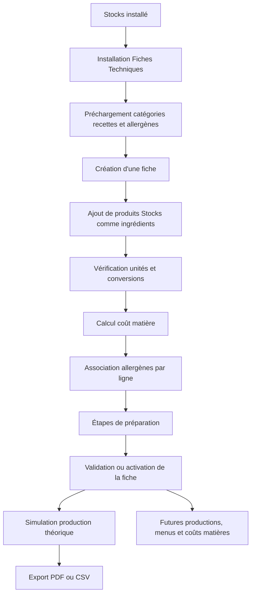

# Plan – ToqueHub « Fiches Techniques »

## 1. Objectif

Créer l’application **📖 Fiches Techniques** comme référentiel culinaire central de ToqueHub.

Le module doit servir de base aux futurs usages :

- Production
- Menus
- Achats
- Cours des Produits
- HACCP
- Coûts matières
- Déstockage automatique

La V1 couvre le périmètre complet demandé : tableau de bord, fiches, catégories recettes, coûts, allergènes, production théorique, historique, recherche, duplication, archivage, exports et intégration au dashboard ToqueHub.

---

## 2. Principes d’architecture validés

### Produits exclusivement issus de Stocks

Le module **Fiches Techniques** ne crée pas de référentiel produit parallèle.

Il réutilise obligatoirement les données du module **Stocks** :

- Produits
- Catégories produits
- Unités
- Prix d’achat
- Conversions d’unités disponibles

Chaque ligne d’ingrédient référence directement un produit existant du module Stocks.

### Interdiction de duplication métier

Ne pas créer de référentiel dupliquant :

- Ingredients
- FoodItems
- RecipeProducts
- ProductRecipes
- ou toute autre structure qui recrée des produits indépendants des Stocks

Le module crée uniquement les données propres aux fiches techniques : fiches, catégories recettes, lignes d’ingrédients liées aux produits Stocks, étapes, allergènes, coûts calculés, instantanés, simulations, exports et historique.

---

## 3. Dépendance au module Stocks

Choix validé : **Stocks obligatoire**.

Comportement attendu :

- Le module Fiches Techniques ne peut être installé ou utilisé que si Stocks est installé.
- Si Stocks est absent, afficher un état bloquant clair.
- L’utilisateur doit être guidé vers l’installation ou la configuration de Stocks.
- Les fiches techniques ne peuvent pas être créées sans produits et unités Stocks disponibles.
- Les calculs de coûts dépendent des prix d’achat issus de Stocks.

---

## 4. Navigation du module

Ajouter l’application :

**📖 Fiches Techniques**

Navigation interne :

```text
📖 Fiches Techniques
├── Tableau de bord
├── Fiches techniques
├── Catégories recettes
├── Coûts
├── Allergènes
└── Production théorique
```

---

## 5. Tableau de bord Fiches Techniques

### En-tête

Titre :

> Fiches Techniques

Sous-titre :

> Centralisez et maîtrisez l’ensemble de vos préparations.

### Cartes statistiques

Afficher :

- Nombre de fiches techniques
- Nombre de catégories recettes
- Coût matière moyen
- Nombre de produits Stocks utilisés dans les fiches

### Dernières fiches modifiées

Afficher :

- Nom
- Catégorie
- Date de modification
- Auteur

### Produits les plus utilisés

Afficher les produits Stocks les plus présents dans les fiches techniques.

Ces données doivent être calculées à partir des lignes d’ingrédients liées aux produits Stocks.

---

## 6. Page « Fiches techniques »

### Liste principale

Afficher pour chaque fiche :

- Photo
- Nom
- Catégorie recette
- Nombre de portions de référence
- Coût matière total
- Coût portion
- Dernière modification
- Statut

### Fonctionnalités

Prévoir :

- Création
- Modification
- Archivage
- Duplication configurable
- Recherche instantanée
- Filtres
- Pagination
- États vides premium
- Chargements optimisés

### Recherche globale

La recherche doit couvrir :

- Nom
- Description
- Catégorie recette
- Produits utilisés

---

## 7. Création et édition d’une fiche technique

### Informations générales

Chaque fiche contient :

- Nom
- Description
- Catégorie recette
- Photo
- Nombre de portions de référence
- Temps de préparation
- Temps de cuisson
- Temps total
- Statut

### Photo

Choix validé :

- Photo par URL
- ou image intégrée

### Statuts

Choix validé :

- Brouillon
- Actif
- Validé
- Archivé

Comportement attendu :

- **Brouillon** : fiche en construction.
- **Actif** : fiche utilisable au quotidien.
- **Validé** : fiche prête à être utilisée comme référence de production.
- **Archivé** : fiche conservée mais retirée des usages courants.

---

## 8. Catégories recettes

Créer un référentiel propre au module Fiches Techniques.

Catégories initiales recommandées :

- Entrées
- Plats
- Desserts
- Sauces
- Accompagnements
- Petit-déjeuner
- Pâtisserie
- Boulangerie
- Boissons

Fonctionnalités :

- Créer
- Modifier
- Archiver

Les catégories recettes ne doivent pas être confondues avec les catégories produits Stocks.

---

## 9. Lignes d’ingrédients

### Principe

La section ingrédients est centrale.

Chaque ligne doit obligatoirement pointer vers un produit existant dans Stocks.

### Informations d’une ligne

Chaque ligne contient :

- Produit Stocks
- Quantité
- Unité
- Commentaire
- Allergènes présents sur cette ligne

### Exemples

- Lait entier — 1000 ml
- Sucre semoule — 200 g
- Beurre doux — 100 g

### Unités et conversions

Choix validé :

- Conversion obligatoire.
- Si l’unité saisie diffère de l’unité de référence du produit, elle doit être convertible via les conversions disponibles dans Stocks.
- Si aucune conversion fiable n’existe, la ligne doit être signalée comme non calculable.
- Une fiche avec des lignes non calculables doit afficher une alerte claire sur les coûts.

---

## 10. Calcul automatique des coûts

### Source des coûts

Les coûts sont calculés à partir des prix d’achat du module Stocks.

### Calculs attendus

Pour chaque fiche :

- Coût total recette
- Coût par portion
- Coût par kilogramme, si applicable
- Coût par litre, si applicable
- Date du dernier calcul

### Gestion de l’évolution des prix

Choix validé :

- Coût actuel calculé à partir des prix Stocks courants
- Instantanés datés des calculs

Comportement attendu :

- La fiche affiche le coût actuel.
- Chaque recalcul important peut conserver un instantané daté.
- Les instantanés servent à expliquer l’évolution du coût matière dans le temps.
- Les futurs liens avec le module Cours des Produits pourront s’appuyer sur ces historiques.

### Page « Coûts »

Prévoir une page dédiée pour :

- Comparer les coûts des fiches
- Identifier les fiches les plus coûteuses
- Voir les dernières dates de calcul
- Repérer les lignes non calculables
- Préparer l’analyse d’impact des variations de prix

---

## 11. Étapes de préparation

Chaque fiche contient une section :

**Étapes**

Chaque étape contient :

- Ordre
- Titre
- Description
- Temps estimé

Exemples :

1. Préparer les ingrédients
2. Chauffer le lait
3. Mélanger les poudres
4. Cuire la crème
5. Refroidir

Fonctionnalités :

- Ajouter
- Modifier
- Supprimer
- Réorganiser

---

## 12. Allergènes

### Référentiel

Choix validé :

- Référentiel standard préchargé
- Modifiable par l’utilisateur
- Archivage possible

Liste standard à précharger :

- Gluten
- Crustacés
- Œufs
- Poissons
- Arachides
- Soja
- Lait
- Fruits à coque
- Céleri
- Moutarde
- Sésame
- Sulfites
- Lupin
- Mollusques

### Association aux fiches

Choix validé :

- Les allergènes sont cochés au niveau des lignes d’ingrédients.
- La fiche agrège automatiquement les allergènes présents sur ses lignes.

Comportement attendu :

- Une fiche affiche la liste consolidée de ses allergènes.
- Les allergènes sont visibles :
  - dans la fiche
  - dans les exports
  - dans la production théorique
  - dans les futures productions

---

## 13. Production théorique

Créer un outil de simulation proportionnelle.

### Exemple attendu

Recette :

> Crème pâtissière

Portions de référence :

> 10

Demande :

> 50 portions

Résultat proportionnel :

- Lait : 5 litres
- Sucre : 1 kg
- Jaunes d’œufs : 40 unités
- Maïzena : 400 g

### Règles

- Tous les calculs sont proportionnels.
- Les unités doivent respecter les règles de conversion disponibles.
- Les lignes non convertibles doivent être signalées.
- La simulation ne déclenche aucun mouvement de stock en V1.
- La simulation prépare les futurs besoins de production et de déstockage automatique.

### Exports

Choix validé :

- Export PDF
- Export CSV
- Impression possible

Les exports doivent inclure :

- Fiche concernée
- Portions demandées
- Ingrédients proportionnés
- Unités
- Coûts estimés
- Allergènes agrégés
- Date de simulation

---

## 14. Historique

Toutes les modifications importantes doivent être historisées.

Événements à suivre :

- Création de fiche
- Modification des informations générales
- Modification des ingrédients
- Modification des allergènes
- Modification des étapes
- Recalcul des coûts
- Duplication
- Archivage
- Changement de statut
- Export ou simulation préparée, si pertinent

Afficher :

- Utilisateur
- Date
- Action
- Résumé lisible

L’historique doit rester conservé même si la fiche est archivée.

---

## 15. Duplication

Choix validé :

- Duplication configurable.

Objectif :

Créer rapidement une variante.

Exemple :

> Crème pâtissière  
> ↓  
> Crème pâtissière chocolat

Comportement attendu :

- L’utilisateur choisit ce qui est copié :
  - Informations générales
  - Photo
  - Ingrédients
  - Étapes
  - Allergènes
  - Catégorie
- La fiche dupliquée doit pouvoir repartir en brouillon.
- Un lien métier avec la fiche source peut être conservé pour traçabilité.
- L’historique de la nouvelle fiche démarre proprement avec l’action de duplication.

---

## 16. Archivage

Règle :

- Ne jamais supprimer définitivement une fiche technique.

Action disponible :

- Archiver

Conserver :

- Historique
- Coûts historiques
- Simulations liées
- Futures productions
- Futurs liens avec les menus

Les fiches archivées sont exclues des usages courants mais restent consultables selon filtre.

---

## 17. Droits utilisateurs

Choix validé :

- Écriture ouverte à tous les utilisateurs connectés.

Comportement attendu :

- Tous les utilisateurs authentifiés peuvent créer, modifier, dupliquer et archiver des fiches.
- Les actions restent historisées avec l’utilisateur concerné.
- Les futures restrictions fines pourront être ajoutées plus tard via les permissions Core.

---

## 18. Intégration avec Stocks

Le module doit consommer Stocks sans duplication.

Réutiliser :

- Produits
- Unités
- Prix d’achat
- Conversions d’unités
- Catégories produits pour la recherche produit uniquement

Ne jamais dupliquer :

- Produits
- Unités
- Prix d’achat
- Catégories produits

Comportement attendu :

- Si un produit Stocks est archivé, les fiches existantes restent consultables.
- Les nouvelles fiches doivent privilégier les produits actifs.
- Les coûts doivent signaler les produits archivés ou non calculables.
- Les futures productions pourront transformer les besoins calculés en mouvements de stock.

---

## 19. Intégration Dashboard ToqueHub

Ajouter une carte :

**Fiches Techniques**

Afficher :

- Nombre de fiches
- Coût moyen
- Dernière modification

Bouton :

> Ouvrir les fiches techniques

La carte doit respecter le design premium existant du catalogue d’applications ToqueHub.

---

## 20. Installation du module

Ajouter l’application au catalogue ToqueHub.

Comportement :

- Statut disponible.
- Installation possible uniquement si Stocks est installé.
- À l’installation :
  - activer le module pour l’organisation
  - précharger les catégories recettes de départ
  - précharger les allergènes standards
  - enregistrer l’action dans l’audit global
- À la désinstallation :
  - désactiver l’accès depuis l’interface
  - conserver toutes les données métier
  - conserver les fiches, historiques, coûts et liens futurs

---

## 21. Expérience utilisateur et design

Contraintes validées :

- Material UI
- Framer Motion
- Responsive mobile
- Responsive desktop
- Mode clair
- Préparation au mode sombre futur
- Cartes premium
- États vides travaillés
- Recherche instantanée
- Chargement optimisé

Inspirations :

- Paprika
- Meisterplan
- Linear
- Notion
- Vercel

Principes UX :

- Interface claire pour les cuisines professionnelles.
- Lecture rapide des coûts et allergènes.
- Création fluide d’une fiche complète.
- Alertes visibles pour les lignes non calculables.
- Tableaux lisibles sur desktop.
- Cartes et formulaires adaptés mobile/tablette.

---

## 22. Performance

Prévoir dès la V1 :

- Requêtes paginées
- Recherche optimisée
- Calculs de coûts maîtrisés
- Relations Prisma propres
- Cache React Query
- Chargements progressifs
- États de chargement propres
- Éviter les recalculs inutiles
- Optimiser les tableaux et listes longues

---

## 23. Données à créer pour Fiches Techniques

Créer uniquement les données propres au module :

- Fiches techniques
- Catégories recettes
- Lignes d’ingrédients liées aux produits Stocks
- Étapes de préparation
- Référentiel allergènes
- Associations allergènes par ligne d’ingrédient
- Instantanés de coûts
- Simulations de production théorique
- Exports préparés
- Historique des modifications
- Activation du module pour l’organisation

Relations essentielles :

- Une fiche appartient à une organisation.
- Une fiche appartient à une catégorie recette.
- Une fiche contient plusieurs lignes d’ingrédients.
- Chaque ligne d’ingrédient pointe vers un produit Stocks.
- Chaque ligne utilise une unité issue de Stocks.
- Une fiche contient plusieurs étapes.
- Une ligne peut porter plusieurs allergènes.
- La fiche agrège les allergènes de ses lignes.
- Les coûts sont calculés depuis les prix Stocks et peuvent être historisés par instantanés.
- Les actions utilisateur alimentent l’historique.

---

## 24. Flux fonctionnel principal



---

## 25. Migration Prisma

À la fin du développement :

- Mettre à jour le schéma Prisma.
- Créer uniquement les structures nécessaires aux fiches techniques.
- Réutiliser les structures Stocks pour produits, unités, catégories produits et prix.
- Vérifier toutes les relations.
- Générer une migration propre.
- Régénérer Prisma Client.
- Vérifier la compatibilité avec :
  - Core
  - Stocks
  - RH
  - Planning
  - Cours des Produits
- Vérifier qu’aucune donnée métier produit n’est dupliquée.
- Vérifier que toutes les relations respectent l’architecture modulaire ToqueHub.

---

## 26. Tests et validations

### Validations fonctionnelles

Vérifier :

- Installation impossible sans Stocks.
- Création d’une fiche complète.
- Ajout de produits Stocks uniquement.
- Recherche par nom, description, catégorie et produits utilisés.
- Calcul coût total et coût portion.
- Gestion des unités convertibles.
- Alerte si unité non convertible.
- Agrégation des allergènes depuis les lignes.
- Réorganisation des étapes.
- Duplication configurable.
- Archivage sans suppression.
- Historique complet.
- Simulation proportionnelle.
- Export PDF et CSV.

### Validations métier

Vérifier :

- Aucune duplication de produit.
- Les prix viennent bien de Stocks.
- Les unités viennent bien de Stocks.
- Les fiches archivées restent consultables.
- Les coûts historiques restent lisibles.
- Les produits archivés dans Stocks n’effacent pas les fiches existantes.

### Validations UX

Vérifier :

- Responsive mobile.
- Responsive desktop.
- États vides.
- États de chargement.
- Recherche instantanée.
- Lisibilité des tableaux.
- Cohérence avec le design ToqueHub.

---

## 27. Livrables V1

La V1 doit livrer :

1. Application installable **Fiches Techniques**
2. Dépendance stricte au module Stocks
3. Dashboard Fiches Techniques
4. Liste et gestion complète des fiches
5. Catégories recettes
6. Lignes d’ingrédients liées aux produits Stocks
7. Calculs de coûts avec instantanés datés
8. Étapes de préparation
9. Référentiel allergènes préchargé et modifiable
10. Allergènes associés par ligne et agrégés sur la fiche
11. Production théorique proportionnelle
12. Exports PDF et CSV
13. Historique des modifications
14. Duplication configurable
15. Archivage sans suppression
16. Recherche globale
17. Carte Dashboard ToqueHub
18. Migration Prisma propre
19. Vérifications d’intégrité inter-modules

---

## 28. Positionnement long terme

Le module **Fiches Techniques** devient la brique culinaire centrale de ToqueHub.

Les futurs modules devront s’appuyer dessus plutôt que recréer leurs propres recettes ou produits :

- Production : calcul des besoins et déstockage futur
- Menus : association des fiches aux menus
- Achats : anticipation des approvisionnements
- Cours des Produits : impact des variations de prix
- HACCP : traçabilité et informations sanitaires
- Coûts matières : pilotage économique des préparations

La V1 doit donc être conçue comme un socle durable, modulaire et strictement connecté au référentiel Stocks.
