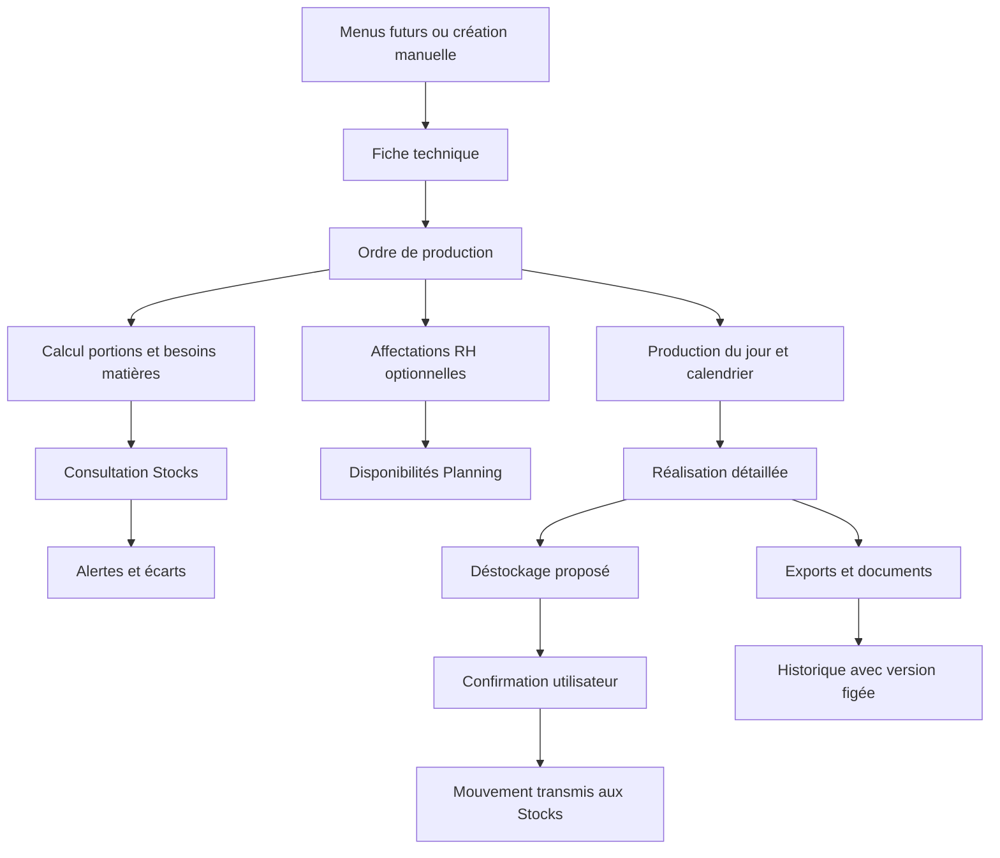

# Plan – Module ToqueHub Production

## 1. Objectif

Créer le module **🏭 Production** comme centre opérationnel des cuisines ToqueHub.

Le module doit transformer les données existantes en **ordres de fabrication exploitables**, sans devenir propriétaire des référentiels métier.

Il orchestre :

- les fiches techniques ;
- les produits et stocks ;
- les collaborateurs, services, postes et roulements ;
- les plannings, présences, absences et disponibilités ;
- les futurs menus.

Public cible :

- restaurants ;
- EHPAD ;
- hôpitaux ;
- collectivités ;
- traiteurs ;
- hôtels ;
- cuisines centrales.

---

## 2. Principes d’architecture

### 2.1 Règle fondamentale

Le module Production **ne crée pas et ne duplique pas** :

- produits ;
- fournisseurs ;
- unités ;
- stocks ;
- collaborateurs ;
- services ;
- postes ;
- roulements ;
- fiches techniques ;
- ingrédients ;
- allergènes.

Ces données restent la propriété des modules existants.

### 2.2 Modules sources

Production doit consommer les modules suivants :

- **Stocks** pour produits, unités, fournisseurs, quantités disponibles et futurs mouvements ;
- **Fiches Techniques** pour recettes, portions de référence, ingrédients, coûts, étapes et allergènes ;
- **RH** pour collaborateurs, services, postes et roulements ;
- **Planning** pour présences, absences, disponibilités et affectations ;
- **Menus** plus tard, pour générer automatiquement des besoins de production.

### 2.3 Données propres à Production

Production est propriétaire uniquement des données liées à l’orchestration :

- ordres de production ;
- statuts de production ;
- besoins matières calculés ;
- affectations à des ordres ;
- priorités ;
- suivis de réalisation ;
- confirmations de contournement d’alertes ;
- historiques ;
- exports générés ;
- versions figées des documents exportés.

---

## 3. Choix fonctionnels validés pour la V1

### Création des ordres

- Création manuelle prioritaire.
- Architecture préparée pour une future génération depuis les Menus.
- Chaque ordre est créé à partir d’une fiche technique, d’une date, d’une heure, d’un nombre de portions et de commentaires éventuels.

### Affectations RH

- Affectation optionnelle en V1.
- Un ordre peut exister sans collaborateur affecté.
- Les collaborateurs non affectés ou ordres sans responsable doivent générer des alertes visibles mais non bloquantes.

### Cycle de statuts

Workflow simple et manuel :

1. Planifiée
2. Validée
3. En cours
4. Terminée
5. Annulée

Le passage de statut est effectué par l’utilisateur.

### Alertes critiques

- Les alertes critiques ne bloquent pas définitivement l’utilisateur.
- Une **confirmation explicite** est nécessaire pour contourner une alerte critique.
- Les confirmations doivent être historisées.

### Stock

- La V1 vérifie les besoins et les écarts de stock.
- À la fin ou au moment choisi par l’utilisateur, le module peut **proposer un déstockage**.
- Le déstockage n’est effectué qu’après confirmation manuelle.
- Aucune sortie de stock automatique non validée par l’utilisateur.

### Services

- Le rattachement à un service est optionnel.
- Le service sert à filtrer, organiser les exports et regrouper les feuilles de production.

### Priorité

- Les ordres peuvent recevoir une priorité manuelle.
- Cette priorité est enrichie par les alertes : retard, manque matière, sous-effectif, charge collaborateur.

### Réalisation

À la clôture d’une production terminée, prévoir un suivi détaillé :

- portions réalisées ;
- heure de début réelle ;
- heure de fin réelle ;
- écarts ;
- pertes ;
- rendement ;
- commentaires ;
- contrôles qualité ;
- causes d’écart.

### Exports

- Les exports doivent être historisés.
- Chaque export important doit conserver une **version figée** des données au moment de génération.

---

## 4. Navigation du module

Navigation cible :

```text
🏭 Production
├── Tableau de bord
├── Ordres de production
├── Calendrier
├── Productions du jour
├── Affectations
├── Besoins matières
├── Exports & Documents
└── Historique
```

---

## 5. Tableau de bord Production

### Titre

**Production**

### Sous-titre

**Pilotez et suivez les productions de votre établissement.**

### Cartes statistiques

Afficher :

- productions prévues aujourd’hui ;
- productions en cours ;
- productions terminées ;
- productions en retard ;
- portions prévues aujourd’hui ;
- portions réalisées aujourd’hui.

### Alertes

Afficher les alertes suivantes :

- productions non démarrées ;
- productions en retard ;
- produits manquants ;
- sous-effectif détecté ;
- collaborateurs non affectés ;
- ordres sans responsable ;
- déstockages proposés non confirmés ;
- productions terminées sans contrôle qualité.

### Comportement

Le tableau de bord doit permettre :

- d’ouvrir rapidement les productions du jour ;
- de consulter les alertes prioritaires ;
- de créer un nouvel ordre ;
- d’accéder aux besoins matières ;
- d’ouvrir les exports du jour.

---

## 6. Ordres de production

### Concept

L’ordre de production est l’objet central du module.

Chaque ordre contient :

- numéro ;
- nom ;
- fiche technique source ;
- date ;
- heure prévue ;
- statut ;
- responsable optionnel ;
- service optionnel ;
- nombre de portions prévues ;
- nombre de portions réalisées ;
- priorité ;
- commentaires ;
- coûts estimés ;
- besoins matières calculés ;
- alertes ;
- suivi réel ;
- historique.

### Exemple

```text
OP-2026-0001
Crème pâtissière
50 portions
Planifiée
```

### Création

L’utilisateur sélectionne :

- une fiche technique ;
- une date ;
- une heure ;
- un nombre de portions ;
- un service optionnel ;
- une priorité optionnelle ;
- des commentaires.

### Calcul automatique

À la création et à chaque changement significatif :

- recalculer toutes les quantités ;
- recalculer tous les besoins matières ;
- recalculer les coûts estimés ;
- récupérer les allergènes depuis la fiche technique ;
- vérifier les stocks disponibles ;
- produire les alertes nécessaires.

### Exemple de recalcul

Fiche technique source :

```text
Crème pâtissière
10 portions
```

Production demandée :

```text
50 portions
```

Résultat attendu :

```text
Lait : 5 L
Sucre : 1 kg
Jaunes d’œufs : 40 unités
Maïzena : 400 g
```

Toutes les quantités doivent être recalculées automatiquement à partir du ratio entre portions demandées et portions de référence.

---

## 7. Gestion des statuts

### Statuts disponibles

- Planifiée
- Validée
- En cours
- Terminée
- Annulée

### Règles V1

- Le workflow est manuel.
- Les transitions restent simples.
- Les alertes critiques demandent confirmation avant contournement.
- Chaque changement de statut est historisé.
- Le passage à “Terminée” déclenche ou propose le formulaire de réalisation détaillée.

### Confirmation de contournement

Une confirmation doit être demandée si l’utilisateur veut poursuivre malgré :

- stock insuffisant ;
- collaborateur absent ;
- sous-effectif ;
- absence de responsable ;
- production en retard ;
- contrôle qualité manquant ;
- quantité réalisée très différente du prévu.

---

## 8. Besoins matières

### Page dédiée

Afficher pour chaque besoin :

- produit ;
- quantité nécessaire ;
- unité ;
- stock disponible ;
- écart ;
- statut ;
- fiche technique source ;
- ordre de production associé ;
- éventuel fournisseur provenant du module Stocks.

### Statuts matière

Prévoir au minimum :

- OK ;
- rupture potentielle ;
- stock insuffisant ;
- produit archivé ;
- unité non convertible ;
- stock non renseigné.

### Exemple

```text
Lait
5 L nécessaires
12 L disponibles
OK
```

```text
Sucre
4 kg nécessaires
2 kg disponibles
Rupture potentielle
```

### Comportement

La page doit permettre :

- de filtrer par date ;
- de filtrer par statut ;
- de filtrer par ordre ;
- de filtrer par service ;
- de consolider les besoins de plusieurs productions ;
- d’exporter les besoins matières ;
- de préparer un déstockage proposé.

---

## 9. Déstockage proposé puis confirmé

### Principe

La V1 ne réalise pas de déstockage automatique.

Le module doit :

1. calculer les besoins ;
2. comparer au stock ;
3. proposer les sorties de stock nécessaires ;
4. demander confirmation ;
5. historiser la confirmation ;
6. transmettre la sortie au module Stocks.

### Règles

- Le module Stocks reste propriétaire des mouvements.
- Production ne conserve pas de stock parallèle.
- Production conserve seulement le lien entre l’ordre et la proposition ou confirmation de déstockage.
- Les écarts entre prévu et réalisé doivent pouvoir influencer la quantité proposée.

### Cas à gérer

- stock suffisant ;
- stock insuffisant mais confirmation de contournement ;
- unité différente entre fiche technique et stock ;
- produit archivé ;
- produit sans stock ;
- déstockage déjà confirmé ;
- production annulée après proposition.

---

## 10. Productions du jour

### Vues rapides

Afficher :

- aujourd’hui ;
- demain ;
- semaine.

### Liste

Chaque production doit afficher :

- heure ;
- priorité ;
- nom ;
- statut ;
- portions prévues ;
- portions réalisées ;
- responsable ;
- service ;
- alertes principales.

### Tri

Tri disponible par :

- heure ;
- priorité ;
- responsable ;
- statut ;
- service.

### Priorité enrichie

La priorité affichée combine :

- priorité manuelle ;
- retard ;
- manque matière ;
- sous-effectif ;
- absence de responsable ;
- écart entre prévu et réalisé.

---

## 11. Calendrier

### Modes

Prévoir :

- jour ;
- semaine ;
- mois.

### Affichage

Afficher :

- productions ;
- statuts ;
- volumes ;
- responsables ;
- services ;
- alertes ;
- priorité.

### Comportement

Le calendrier doit permettre :

- une lecture fluide des charges ;
- l’ouverture rapide d’un ordre ;
- le changement de période ;
- la création d’un ordre depuis une date ;
- une vue responsive mobile et desktop.

---

## 12. Affectations

### Principe

Production réutilise RH et Planning.

Le module permet d’affecter :

```text
Collaborateur
↓
Ordre de production
```

### Exemples

```text
Paul Breton
↓
Production Hachis Parmentier
```

```text
Marie Leroy
↓
Production Crème Dessert
```

### Règles V1

- Affectation optionnelle.
- Les affectations enrichissent le pilotage mais ne bloquent pas la création.
- Les absences et disponibilités doivent être consultées via Planning.
- Les informations collaborateur viennent de RH.
- Les postes et services viennent de RH.
- Les présences, absences et disponibilités viennent du Planning.

### Vue collaborateur

Afficher :

- productions assignées ;
- charge de travail ;
- temps prévu ;
- historique ;
- alertes de disponibilité ;
- productions terminées associées.

### Charge de production

Calculer :

- nombre de productions ;
- nombre de portions ;
- temps théorique ;
- temps réel si disponible ;
- répartition par collaborateur ;
- alertes de surcharge.

---

## 13. Réalisation détaillée

À la fin d’une production, l’utilisateur doit pouvoir renseigner :

- portions réalisées ;
- heure de début réelle ;
- heure de fin réelle ;
- pertes ;
- écarts ;
- rendement ;
- contrôle qualité ;
- commentaires ;
- causes d’écart ;
- validation responsable ;
- confirmation ou non du déstockage proposé.

### Objectif

Comparer :

- prévu vs réalisé ;
- temps théorique vs temps réel ;
- portions prévues vs portions réalisées ;
- coût estimé vs coût potentiel réel ;
- besoin matière prévu vs besoin matière ajusté.

---

## 14. Historique

Historiser :

- création ;
- modification ;
- validation ;
- annulation ;
- changement de statut ;
- affectation collaborateur ;
- suppression ou remplacement d’affectation ;
- confirmation de contournement d’alerte ;
- proposition de déstockage ;
- confirmation de déstockage ;
- génération d’export ;
- clôture de réalisation ;
- contrôle qualité ;
- modification des portions réalisées.

Chaque événement affiche :

- utilisateur ;
- date ;
- action ;
- résumé ;
- données utiles à l’audit.

---

## 15. Exports & Documents

### Objectif

La page Exports & Documents doit permettre de générer les documents opérationnels pour les équipes.

### Feuille de production

Document PDF imprimable.

Titre :

```text
Feuille de production du jour
```

Informations :

- date ;
- établissement ;
- service optionnel ;
- responsable ;
- productions prévues.

Productions prévues :

- nom recette ;
- nombre de portions ;
- heure prévue ;
- responsable ;
- statut ;
- priorité.

Besoins matières :

- produit ;
- quantité ;
- unité ;
- statut stock.

Collaborateurs affectés :

- nom ;
- poste ;
- mission.

Allergènes :

- allergènes provenant automatiquement des fiches techniques.

Contrôles :

- préparation terminée ;
- production terminée ;
- contrôle qualité effectué ;
- validation responsable.

Signature :

- zone signature responsable.

### Exports disponibles

Prévoir :

- PDF Production ;
- PDF Besoins matières ;
- PDF Répartition équipes ;
- Excel Production ;
- Excel Besoins matières ;
- impression directe.

### Historisation des exports

Chaque export important doit conserver :

- utilisateur ;
- date ;
- type de document ;
- période ;
- service éventuel ;
- ordres concernés ;
- version figée des données exportées.

---

## 16. Dashboard ToqueHub

Ajouter une carte **Production** au dashboard principal.

### Contenu de la carte

Afficher :

- productions du jour ;
- portions prévues ;
- productions en retard.

### Action

Bouton :

```text
Ouvrir la production
```

### État

La carte doit refléter :

- module non installé ;
- module installé sans production ;
- productions du jour ;
- alertes critiques ;
- retard.

---

## 17. États vides et cas limites

Prévoir des états vides premium pour :

- aucune production planifiée ;
- aucune fiche technique disponible ;
- aucun stock disponible ;
- aucun collaborateur RH ;
- Planning non disponible ;
- aucun besoin matière ;
- aucun export généré ;
- historique vide.

### Messages attendus

Les états vides doivent expliquer :

- ce qui manque ;
- quel module source est concerné ;
- quelle action l’utilisateur peut effectuer ;
- ce que Production ne duplique pas.

---

## 18. Design et expérience utilisateur

### Contraintes

Respecter :

- Material UI ;
- Framer Motion ;
- responsive mobile ;
- responsive desktop ;
- cartes modernes ;
- calendriers performants ;
- vue planning fluide ;
- états vides travaillés ;
- mode clair ;
- préparation au mode sombre futur ;
- design premium.

### Inspirations

S’inspirer de :

- Skello ;
- Notion ;
- Linear ;
- Vercel ;
- Monday ;
- ERPNext.

### Direction UX

Le module doit donner une sensation de centre opérationnel :

- lecture rapide ;
- actions visibles ;
- statuts clairs ;
- alertes compréhensibles ;
- documents accessibles ;
- planification fluide ;
- hiérarchie visuelle forte ;
- interface adaptée aux cuisines en situation réelle.

---

## 19. Modèle de données à prévoir

Prévoir les entités nécessaires pour :

- ordres de production ;
- lignes de besoins matières calculées ;
- affectations collaborateur-ordre ;
- événements d’historique ;
- exports et versions figées ;
- confirmations de contournement ;
- propositions et confirmations de déstockage ;
- suivi de réalisation détaillée ;
- priorités ;
- alertes ou états calculés.

### Relations attendues

Les ordres doivent être reliés proprement à :

- l’organisation ;
- la fiche technique source ;
- les produits via les besoins matières ;
- les unités via les produits et fiches techniques ;
- les collaborateurs RH ;
- les services RH optionnels ;
- les données Planning consultées ;
- les mouvements Stocks confirmés ;
- les utilisateurs pour l’historique.

---

## 20. Migration Prisma

À la fin du développement :

- mettre à jour le schéma Prisma avec toutes les entités nécessaires à Production ;
- réutiliser les tables existantes Core, RH, Planning, Stocks et Fiches Techniques ;
- ne dupliquer aucune donnée métier existante ;
- créer des relations propres entre les ordres de production et les autres modules ;
- vérifier les contraintes d’intégrité référentielle ;
- vérifier les index nécessaires pour les recherches, calendriers, historiques et exports ;
- générer une migration Prisma propre ;
- régénérer Prisma Client ;
- vérifier la compatibilité avec une installation neuve ;
- vérifier la compatibilité avec une instance possédant déjà Core, Stocks, RH, Planning, Fiches Techniques et Cours des Produits ;
- vérifier qu’aucune relation existante n’est cassée ;
- vérifier qu’aucune donnée métier n’est dupliquée.

---

## 21. Flux cible



---

## 22. Vision long terme

Le module Production doit être préparé pour devenir le moteur opérationnel de ToqueHub :

```text
Menus
↓
Fiches Techniques
↓
Production
↓
Stocks
↓
Achats
↓
HACCP
```

Évolutions futures prévues :

- déstockage automatique ;
- gestion des lots ;
- traçabilité HACCP ;
- génération depuis les menus ;
- prévisions de production ;
- calculs automatiques de besoins ;
- achats automatiques ;
- lien renforcé avec les contrôles qualité ;
- suivi des rendements par recette ;
- analyse des écarts de production.

---

## 23. Critères d’acceptation

Le module est considéré prêt lorsque :

- un ordre peut être créé depuis une fiche technique ;
- les portions recalculent automatiquement toutes les quantités ;
- les besoins matières consultent le stock sans le dupliquer ;
- les alertes critiques demandent confirmation pour être contournées ;
- les affectations RH sont possibles mais optionnelles ;
- le service est optionnel ;
- les productions du jour, calendrier et besoins matières sont exploitables ;
- la réalisation détaillée est disponible à la clôture ;
- le déstockage est proposé puis confirmé manuellement ;
- les documents PDF, Excel et impression sont prévus ;
- les exports importants sont historisés avec version figée ;
- le dashboard ToqueHub affiche une carte Production ;
- la navigation Production est complète ;
- aucune donnée propriétaire d’un autre module n’est recréée ;
- la migration Prisma est propre et compatible avec les installations existantes.
