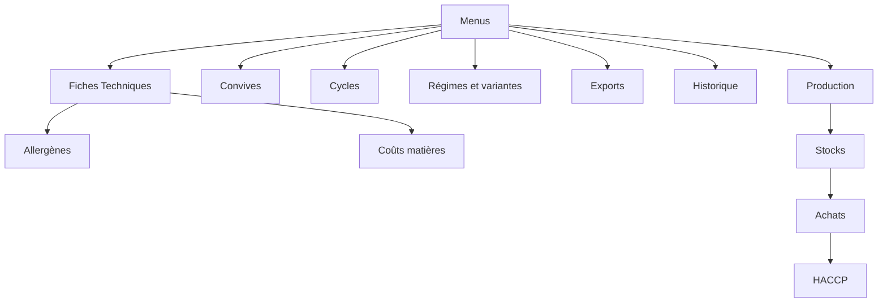
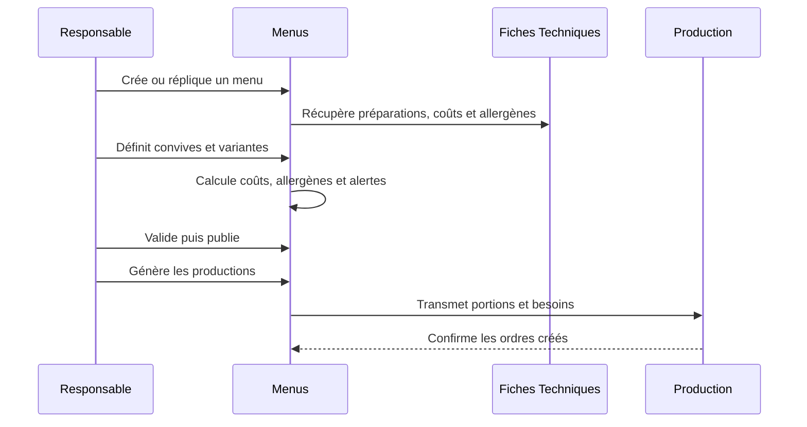

# Plan – ToqueHub · Module 🍽️ Menus

## 1. Objectif V1

Créer une V1 fonctionnelle complète du module **Menus**, conçu comme le point d’entrée de l’organisation culinaire dans ToqueHub.

Le module doit permettre de :

- planifier les repas ;
- organiser les cycles alimentaires ;
- gérer les variantes par régime ;
- prévoir les convives ;
- calculer les coûts prévisionnels ;
- visualiser les allergènes ;
- générer les productions ;
- exporter les menus et documents opérationnels ;
- historiser les actions clés.

Le module **Menus** organise uniquement la planification.  
Il ne possède pas les recettes, produits, ingrédients, stocks ou collaborateurs.

---

## 2. Règles fondamentales d’architecture

### Données consommées

Le module Menus consomme obligatoirement :

- **Fiches Techniques** ;
- **Allergènes** issus des fiches techniques ;
- **Coûts matières** issus des fiches techniques ;
- **Production** pour générer les ordres de production ;
- **Core** pour l’organisation, les utilisateurs et les sites ;
- **Stocks** indirectement via les fiches techniques et la production ;
- **Cours des Produits** uniquement comme intégration future.

### Données interdites à créer depuis Menus

Le module Menus ne doit jamais créer :

- produits ;
- ingrédients ;
- recettes ;
- stocks ;
- collaborateurs.

Toutes les préparations ajoutées à un menu doivent obligatoirement référencer une **fiche technique existante**.

---

## 3. Dépendances d’installation validées

Pour la V1, le module Menus est installé uniquement si les dépendances suivantes sont déjà disponibles :

1. **Fiches Techniques**
2. **Production**

La Production est donc obligatoire pour installer Menus.

Conséquence :

- le bouton **Générer les productions** est actif dès la V1 ;
- Menus peut créer des productions exploitables immédiatement ;
- Menus ne propose pas de mode autonome sans Fiches Techniques ni Production.

---

## 4. Navigation cible

Ajouter une entrée principale :

```text
🍽️ Menus
├── Tableau de bord
├── Menus
├── Calendrier
├── Cycles
├── Régimes alimentaires
├── Convives
├── Exports
└── Historique
```

Chaque entrée doit être accessible depuis une navigation cohérente avec les autres modules ToqueHub.

---

## 5. Tableau de bord Menus

### Titre

**Menus**

### Sous-titre

**Planifiez vos repas et anticipez vos productions.**

### Cartes statistiques

Afficher :

- Menus actifs ;
- Menus de la semaine ;
- Cycles actifs ;
- Convives prévus aujourd’hui ;
- Coût moyen par repas.

### Alertes

Afficher des alertes claires pour :

- menus incomplets ;
- fiches techniques manquantes ou archivées ;
- allergènes critiques ;
- menus sans estimation de convives ;
- menus validés mais non générés en production ;
- productions déjà générées mais menu modifié depuis.

### Actions rapides

Prévoir :

- créer un menu ;
- ouvrir le calendrier ;
- créer un cycle ;
- gérer les régimes alimentaires ;
- générer les productions à partir des menus prêts.

---

## 6. Gestion des menus

### Liste principale

La page Menus affiche :

- nom ;
- date ;
- type de service ;
- site ;
- nombre de convives ;
- coût estimé ;
- statut ;
- indicateur de génération Production ;
- indicateur d’allergènes.

### Statuts

Les statuts V1 sont :

- Brouillon ;
- Validé ;
- Publié ;
- Archivé.

### Services possibles

Les services disponibles sont :

- Petit-déjeuner ;
- Déjeuner ;
- Dîner ;
- Collation ;
- Événement ;
- Buffet.

### Création d’un menu

Un menu contient :

- nom ;
- date ;
- service ;
- site ;
- description ;
- nombre prévisionnel de convives ;
- statut initial Brouillon ;
- composition culinaire ;
- variantes éventuelles ;
- historique.

### Composition du menu

Sections prévues :

- Entrée ;
- Plat principal ;
- Accompagnement ;
- Fromage ;
- Dessert ;
- Boisson ;
- Autre.

Chaque élément de section référence obligatoirement une fiche technique existante.

### Règles métier

- Un menu ne peut pas être validé si une section obligatoire décidée par l’établissement est vide.
- Un menu ne peut pas être validé si une préparation n’a plus de fiche technique active.
- Un menu ne duplique jamais les coûts ou allergènes comme données propriétaires : il les lit et peut conserver des valeurs de consultation ou d’export au moment nécessaire.
- Un menu archivé reste consultable pour l’historique et les exports passés.

---

## 7. Calendrier Menus

### Vues

Prévoir les vues :

- Jour ;
- Semaine ;
- Mois ;
- Année.

### Affichage

Le calendrier affiche tous les menus planifiés, avec :

- service ;
- site ;
- statut ;
- nombre de convives ;
- coût estimé ;
- alertes principales ;
- état de génération Production.

### Navigation rapide

Prévoir :

- Aujourd’hui ;
- Cette semaine ;
- Ce mois.

### Comportement attendu

- Le calendrier doit permettre une lecture rapide des repas planifiés.
- Les menus doivent être distinguables par service et par statut.
- Les vues doivent être adaptées mobile et desktop.
- Les états vides doivent guider l’utilisateur vers la création d’un menu ou d’un cycle.

---

## 8. Cycles de menus

### Types de cycles

La V1 doit permettre de créer :

- Cycle 2 semaines ;
- Cycle 4 semaines ;
- Cycle 6 semaines ;
- Cycle 8 semaines ;
- Cycle personnalisé.

### Structure

Un cycle contient :

- nom ;
- description ;
- durée ;
- semaines ;
- jours ;
- services ;
- compositions de menus ;
- variantes éventuelles ;
- site cible ou périmètre ;
- statut actif ou archivé.

### Réplication automatique

Choix validé : **copies traçables avec resynchronisation manuelle**.

Comportement :

- le cycle sert de modèle ;
- la réplication crée des menus indépendants ;
- chaque menu généré conserve la trace du cycle source ;
- les menus peuvent être modifiés sans altérer le cycle ;
- une resynchronisation manuelle peut être proposée pour les périodes futures ;
- les menus déjà publiés ou déjà générés en production ne doivent pas être modifiés automatiquement sans validation explicite.

### Cas d’usage

Exemple :

```text
Cycle EHPAD 4 semaines
↓
Semaine 1
Semaine 2
Semaine 3
Semaine 4
↓
Réplication sur une période future
↓
Menus planifiés indépendants, traçables et resynchronisables
```

---

## 9. Régimes alimentaires

### Référentiel V1

Créer un référentiel de régimes alimentaires avec les valeurs initiales :

- Standard ;
- Sans porc ;
- Mixé ;
- Haché ;
- Diabétique ;
- Sans sel ;
- Végétarien ;
- Végétalien ;
- Texture modifiée ;
- Autre.

### Gestion

Chaque régime peut être :

- actif ;
- archivé ;
- décrit ;
- utilisé dans des variantes ;
- utilisé pour les estimations de convives.

---

## 10. Variantes de menus

Choix validé : **mode hybride**.

La V1 doit permettre deux approches.

### Variante dérivée

Une variante est rattachée à un menu standard et remplace uniquement certaines fiches techniques.

Exemple :

```text
Menu standard
↓
Menu sans porc
↓
Menu mixé
↓
Menu haché
```

Comportement :

- même date ;
- même service ;
- même site ;
- convives ajustables par régime ;
- seules certaines préparations sont remplacées ;
- les coûts et allergènes sont recalculés selon les fiches techniques de remplacement.

### Menu complet par régime

Un régime peut aussi avoir un menu complet séparé, relié à une famille de menus.

Comportement :

- utile pour les établissements ayant des plans alimentaires très différenciés ;
- chaque menu conserve sa composition complète ;
- la relation avec le menu standard reste visible.

### Règles

- Une variante ne peut remplacer une préparation que par une fiche technique existante.
- Les allergènes et coûts de la variante sont calculés à partir des fiches techniques réellement utilisées.
- Les convives peuvent être répartis par régime.

---

## 11. Gestion des convives

Choix validé : **comptages par groupes**.

### Niveau de détail V1

Les convives sont définis par :

- menu ;
- service ;
- date ;
- site ;
- groupe de convives ;
- régime alimentaire éventuel.

### Groupes de convives

Prévoir une gestion par groupes, par exemple :

- résidents ;
- patients ;
- élèves ;
- clients ;
- personnel ;
- invités ;
- autre.

### Exemple

```text
Déjeuner
Résidents standard : 90
Résidents mixé : 20
Personnel : 10
Total : 120 convives
```

### Règles

- Le total des convives alimente les coûts prévisionnels.
- Le détail par régime alimente les variantes.
- Les productions tiennent compte des volumes par fiche technique réellement utilisée.
- Aucune gestion nominative des convives n’est prévue en V1.

---

## 12. Coûts prévisionnels

### Source des coûts

Les coûts proviennent des fiches techniques existantes.

Le module Menus affiche :

- coût total du menu ;
- coût moyen par convive ;
- coût par service ;
- coût par variante ;
- coût par régime si des convives sont répartis ;
- coût total prévisionnel sur une période.

### Règles

- Les coûts se recalculent lorsque les fiches techniques changent.
- Les menus publiés et les exports figés doivent conserver une lecture cohérente avec le moment de publication ou d’export.
- Les coûts non calculables doivent générer une alerte claire.

---

## 13. Allergènes

### Source

Les allergènes sont récupérés automatiquement depuis les fiches techniques.

### Affichage

Afficher clairement les allergènes présents :

- Gluten ;
- Lait ;
- Œufs ;
- Poisson ;
- Fruits à coque ;
- Arachides ;
- Soja ;
- Céleri ;
- Moutarde ;
- Sésame ;
- Sulfites ;
- Lupin ;
- Mollusques ;
- Crustacés ;
- autres allergènes définis dans les fiches techniques.

### Règles

- Les allergènes doivent être visibles au niveau du menu.
- Ils doivent être visibles au niveau des variantes.
- Les allergènes critiques doivent déclencher des alertes.
- Les exports destinés aux résidents, patients, élèves ou clients doivent présenter une visualisation claire.

---

## 14. Génération des productions

Choix validé : **choix à la génération**.

### Bouton principal

Ajouter l’action :

**Générer les productions**

### Préconditions

La génération est possible si :

- le menu est validé ou publié ;
- les fiches techniques sont actives ;
- les convives sont renseignés ;
- les variantes nécessaires sont cohérentes ;
- Production est disponible ;
- aucune alerte bloquante n’est présente.

### Modes de génération

L’utilisateur choisit au moment de générer :

#### Mode détaillé

- un ordre de production par fiche technique ;
- portions calculées selon les convives et variantes ;
- utile pour une cuisine organisée par préparations.

#### Mode regroupé

- un ordre global par menu ou service ;
- détail des préparations transmis à la Production ;
- utile pour une lecture centralisée.

### Exemple

```text
Menu
120 convives
↓
Hachis Parmentier
120 portions
↓
Ordre de production créé
```

### Comportement

- Les portions sont calculées automatiquement.
- Les besoins sont transmis à Production.
- Les productions générées gardent une origine Menus.
- Le menu indique que la production a été générée.
- Si le menu change après génération, une alerte signale l’écart potentiel.
- La regénération doit être contrôlée pour éviter les doublons.

---

## 15. Exports & documents

Choix validé : **mode mixte selon le type de document**.

### Documents PDF et affichage public

Les PDF et documents d’affichage public sont générés avec un contenu figé.

Objectif :

- conserver la version exacte diffusée ;
- permettre un historique fiable ;
- éviter qu’un changement ultérieur de fiche technique ne modifie un document déjà transmis.

Versions prévues :

- Cuisine ;
- Salle ;
- Résidents ;
- Patients ;
- Affichage public.

### Contenu PDF minimal

Afficher :

- date ;
- service ;
- site ;
- entrée ;
- plat ;
- accompagnement ;
- fromage ;
- dessert ;
- boisson ;
- allergènes ;
- variantes si nécessaire.

### Affichage public

Prévoir un format adapté à :

- restaurant ;
- EHPAD ;
- hôpital ;
- école ;
- hôtel ;
- traiteur.

### Export Excel

Les exports Excel sont générés à la demande et historisés.

Exporter :

- menus ;
- cycles ;
- convives ;
- coûts ;
- variantes ;
- allergènes ;
- historique selon les droits.

---

## 16. Historique

Historiser :

- création ;
- modification ;
- validation ;
- publication ;
- archivage ;
- génération des productions ;
- export ;
- réplication de cycle ;
- resynchronisation manuelle ;
- modification des convives ;
- modification des variantes.

Afficher :

- utilisateur ;
- date ;
- action ;
- contexte ;
- menu ou cycle concerné.

L’historique doit être consultable depuis la section dédiée et depuis les objets concernés.

---

## 17. Tableau de bord ToqueHub

Ajouter une carte **Menus** au dashboard général ToqueHub.

### Contenu

Afficher :

- menus aujourd’hui ;
- convives prévus ;
- coût moyen ;
- alertes critiques éventuelles.

### Action

Bouton :

**Ouvrir les menus**

### Comportement

- Si Menus est installé, la carte ouvre le module.
- Si Menus n’est pas installé, la carte peut guider vers l’installation, sous réserve des dépendances obligatoires.

---

## 18. Contrôle d’accès V1

Choix validé : **règles simples par niveau de rôle**.

### Règles

- Les utilisateurs ayant accès au module peuvent consulter les menus.
- Les utilisateurs opérationnels autorisés peuvent créer et modifier des brouillons.
- Les managers et administrateurs peuvent :
  - valider ;
  - publier ;
  - archiver ;
  - générer les productions ;
  - gérer les cycles ;
  - gérer les régimes ;
  - lancer les exports.

### Historisation

Les actions sensibles doivent être historisées.

---

## 19. Design et expérience utilisateur

### Contraintes techniques et design

Respecter :

- Material UI ;
- Framer Motion ;
- responsive mobile ;
- responsive desktop ;
- calendrier moderne ;
- cartes premium ;
- états vides travaillés ;
- mode clair ;
- préparation au mode sombre futur ;
- performances optimisées.

### Inspirations

S’inspirer de :

- NetMenu ;
- Skello ;
- Factorial ;
- Notion ;
- Linear ;
- Vercel.

### Principes UX

- Lecture rapide de la semaine alimentaire.
- Création fluide d’un menu.
- Recherche simple de fiches techniques.
- Alertes visibles mais non envahissantes.
- Statuts lisibles.
- Coûts et allergènes compréhensibles.
- Actions critiques confirmées.
- États vides utiles et orientés action.

---

## 20. Architecture fonctionnelle cible



Le module Menus démarre la chaîne culinaire, sans devenir propriétaire des données des autres modules.

---

## 21. Migration Prisma et intégrité des données

À la fin du développement, prévoir une évolution propre du modèle de données.

### Objectifs

Créer les entités nécessaires pour représenter :

- menus ;
- éléments de menus ;
- cycles ;
- occurrences issues de cycles ;
- régimes alimentaires ;
- variantes ;
- groupes de convives ;
- prévisions de convives ;
- exports ;
- historiques ;
- liens vers Production.

### Règles d’intégrité

Vérifier que :

- les fiches techniques restent référencées sans duplication ;
- les produits ne sont jamais dupliqués ;
- les ingrédients ne sont jamais dupliqués ;
- les collaborateurs ne sont jamais dupliqués ;
- les relations avec les sites et utilisateurs sont cohérentes ;
- les menus liés à des productions conservent une traçabilité claire ;
- les recherches et vues calendrier sont performantes ;
- les contraintes empêchent les incohérences majeures.

### Compatibilité

Vérifier la compatibilité avec :

- Core ;
- Stocks ;
- RH ;
- Planning ;
- Fiches Techniques ;
- Production ;
- Cours des Produits.

### Finalisation

Prévoir :

- migration propre ;
- régénération du client Prisma ;
- vérification de l’intégrité référentielle ;
- vérification de l’absence de duplication métier ;
- validation du comportement multi-organisation.

---

## 22. Intégrations futures prévues

### Stocks

Objectif futur :

```text
Menus
↓
Analyse prévisionnelle des besoins
↓
Consommation théorique
↓
Anticipation des ruptures
```

La V1 doit préparer cette évolution sans la rendre obligatoire au-delà de ce que Production sait déjà exploiter.

### Cours des Produits

Objectif futur :

- afficher l’impact des variations marché sur le coût du menu ;
- identifier les menus sensibles à certaines hausses ;
- aider à arbitrer les cycles alimentaires selon les coûts.

### Achats et HACCP

Vision long terme :

```text
Menus
↓
Fiches Techniques
↓
Production
↓
Stocks
↓
Achats
↓
HACCP
```

---

## 23. Parcours utilisateur cible



---

## 24. Critères d’acceptation V1

La V1 est considérée complète lorsque :

- le module Menus s’installe uniquement si Fiches Techniques et Production sont disponibles ;
- la navigation Menus complète est accessible ;
- un menu peut être créé, composé avec des fiches techniques, validé, publié et archivé ;
- les services prévus sont disponibles ;
- les sections de menu prévues sont disponibles ;
- les coûts prévisionnels sont calculés depuis les fiches techniques ;
- les allergènes sont agrégés depuis les fiches techniques ;
- les convives sont gérés par groupes ;
- les variantes hybrides sont utilisables ;
- les cycles peuvent être créés, répliqués, tracés et resynchronisés manuellement ;
- le calendrier affiche les menus en jour, semaine, mois et année ;
- les productions peuvent être générées en mode détaillé ou regroupé ;
- les exports PDF, affichage public et Excel sont disponibles selon le mode d’historisation validé ;
- l’historique couvre les actions clés ;
- la carte Menus est visible sur le dashboard ToqueHub ;
- les règles simples de rôles sont respectées ;
- aucune recette, produit, ingrédient, stock ou collaborateur n’est créé par Menus ;
- la migration Prisma est propre, relationnelle et compatible avec les modules existants.
