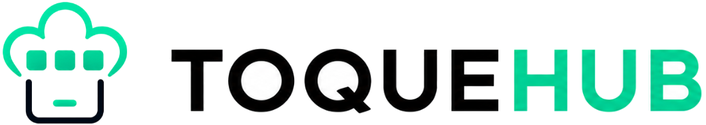

<p align="center">
  
</p>

<p align="center">
  <strong>Le système d'exploitation open source des cuisines professionnelles.</strong><br />
  Stocks, HACCP, production, RH, planning, menus, traçabilité et app mobile terrain dans une seule plateforme locale.
</p>

<p align="center">
  
  
  
  
</p>

---

## Vision

ToqueHub remplace les tableurs, classeurs HACCP, exports isolés et applications métier dispersées par un ERP modulaire pensé pour les restaurants, cuisines centrales, EHPAD, hôtels, traiteurs et collectivités.

La plateforme est self-hosted, locale par défaut, et construite autour d'un socle commun: les produits, unités, fournisseurs, collaborateurs, stocks, droits et mouvements sont partagés entre les modules au lieu d'être recopiés partout.

> Couleurs projet: émeraude `#10b981`, teal profond `#0f766e`, vert système `#1f6f43`, accent cuisine `#a88e6a`, surfaces claires `#f8fafc`.

## Aperçu

Ajoute tes captures dans `docs/assets/screenshots/` puis remplace les chemins ci-dessous.

| Dashboard web | Module HACCP mobile | Stocks & OCR |
| --- | --- | --- |
| `docs/assets/screenshots/dashboard-web.png` | `docs/assets/screenshots/mobile-haccp.png` | `docs/assets/screenshots/stocks-ocr.png` |

## Ce que fait ToqueHub

ToqueHub combine un back-office web, une API REST NestJS, une base PostgreSQL, un profil Docker/Raspberry Pi et une application mobile Expo/React Native.

- Centraliser le référentiel produits, unités, catégories, fournisseurs, sites et emplacements.
- Suivre les stocks avec une règle stricte: la quantité n'est jamais modifiée directement, chaque variation passe par un mouvement historisé.
- Digitaliser les contrôles HACCP: températures, réceptions, traçabilité, nettoyage, huiles, refroidissement, congélation, réchauffement, rapports.
- Piloter les fiches techniques, les coûts matières, la production, les menus et les besoins matière.
- Structurer les RH: collaborateurs, services, postes, documents, droits, compteurs et conformité.
- Préparer les plannings, présences, absences, remplacements, rotations et exports.
- Connecter le terrain avec une app mobile capable de découvrir un serveur local, fonctionner hors ligne pour HACCP et imprimer des étiquettes.

## Modules disponibles

| Module | Statut | Rôle |
| --- | --- | --- |
| **Core & Dashboard** | Disponible | Authentification, onboarding, organisation, préférences dashboard, informations d'instance et socle multi-établissement. |
| **Stocks** | Disponible | Catalogue produits, catégories, unités, fournisseurs, lots, sites, emplacements, inventaires, mouvements, audit CSV et projection de stock. |
| **OCR Stocks** | Disponible | Import de documents d'achat, analyse OCR/IA, corrections, rapprochement fournisseur/produit et création de réception. |
| **Marges** | Disponible | Paramètres de marge, dashboard, analyses par produit/fournisseur, alertes et rapports CSV. |
| **Cours des Produits** | Disponible | Veille RNM FranceAgriMer, recherche, historiques, favoris et tendances de marché. |
| **Fiches Techniques** | Disponible | Recettes, catégories, allergènes, étapes, coûts, simulations, duplication, archivage et exports. |
| **Production** | Disponible | Ordres de fabrication, besoins matières, affectations, alertes, réalisation, déstockage proposé/confirmé, calendrier et historique. |
| **Menus** | Disponible | Plans de menus, cycles, variantes, régimes, groupes de convives, prévisions, exports et génération de productions. |
| **HACCP** | Disponible | Températures, réceptions, traçabilité, produits HACCP, refroidissement, congélation, réchauffement, huiles, nettoyage, photos et rapports journaliers. |
| **RH** | Disponible | Collaborateurs, organigramme, services, postes, documents RH, onboarding, droits, règles et compteurs temps. |
| **Planning** | Disponible | Affectations, besoins, absences, présences, dictionnaire de codes, modèles, rotations, génération, publication, verrouillage et exports. |
| **Droits & conformité** | Disponible | Moteur de droits France, recommandations d'onboarding, calculs applicables et diagnostics conformité planning. |
| **Utilisateurs & accès** | Disponible | Comptes, rôles, permissions, invitations, statuts et rattachement collaborateur. |
| **Documents** | Disponible | Liste documentaire, téléchargement et mise à jour de métadonnées. |
| **Sauvegardes** | Disponible | Inspection, création, restauration, planning, upload, téléchargement et intégration Google Drive chiffrée. |
| **Architecture Center** | Disponible | Cartographie modules, schéma, relations, doublons, impact et documentation technique. |
| **Discovery Mobile** | Disponible | Endpoint `/api/discovery` et publication mDNS `_toquehub._tcp` pour connecter l'app mobile au serveur local. |
| **Achats** | Bientôt disponible | Commandes fournisseurs et réceptions simplifiées. |

## Application mobile

L'app mobile se trouve dans le workspace voisin `../AppToqueHub`. Elle est construite avec Expo 54, React Native 0.81, React 19, React Navigation, React Query, AsyncStorage, SecureStore, SQLite, Zeroconf et des modules natifs Brother.

### Parcours mobile

- Découverte automatique des serveurs ToqueHub sur le réseau local via mDNS.
- Connexion manuelle possible par URL si la découverte réseau n'est pas disponible.
- Session serveur persistée et contexte de synchronisation HACCP.
- Interface mobile centrée terrain, avec module HACCP comme écran principal.
- Mode offline HACCP via SQLite et file d'opérations en attente.
- Synchronisation automatique quand le serveur redevient joignable.
- Notifications HACCP et suivi des actions du jour.

### Écrans HACCP mobiles

| Zone | Écrans |
| --- | --- |
| Tableau de bord | Vue synthèse HACCP, états du jour, raccourcis opérationnels. |
| Températures | Équipements, relevés, détail de lecture, ajout d'équipement. |
| Réceptions | Contrôles à réception et historique. |
| Traçabilité | Lots, détail, ajout, édition et analyse image. |
| Production HACCP | Sessions de production, photos, historique. |
| Nettoyage | Zones, session active, surfaces nettoyées, historique et détail jour. |
| Refroidissement | Création de session, suivi, historique. |
| Congélation & réchauffement | Process HACCP dédiés. |
| Huiles | Équipements, sessions, photos et historique. |
| Produits HACCP | Produits, ajout et historique. |
| Étiqueteuse | Configuration imprimante et impression d'étiquettes. |
| Rapports journaliers | Génération, historique, statistiques et téléchargement. |

### Impression terrain

ToqueHub Mobile intègre le SDK Brother pour les imprimantes TD-2130N:

- découverte réseau des imprimantes;
- liste des templates P-touch installés;
- impression par template avec remplacements de texte;
- transfert de templates;
- support iOS via `BRLMPrinterKit.xcframework`;
- support Android via `BrotherPrintLibrary.aar`.

Un build natif est nécessaire: Expo Go ne charge pas les modules Brother.

```bash
cd ../AppToqueHub
npm install
npm run ios
npm run android
```

## Architecture

```text
toquehub-main/
  apps/
    api/       NestJS + Prisma + PostgreSQL
    web/       React + TypeScript + Vite
    landing/   Landing/demo Vite
    video/     Présentation Remotion
  packages/
    core/      Socle partagé
    ui/        Composants partagés
    shared-types/
  docker/      Images, Compose, Nginx, entrypoint API
  scripts/     Installation, Docker, Raspberry Pi, IoT, backup
  docs/        Documentation et assets README

../AppToqueHub/
  src/
    modules/hygiene/
    services/
    discovery/
    navigation/
  ios/         SDK Brother iOS
  android/     SDK Brother Android
```

## Stack technique

| Couche | Technologies |
| --- | --- |
| API | NestJS, Prisma, Swagger, JWT, PostgreSQL |
| Web | React, TypeScript, Vite, Material UI, Lucide, Framer Motion |
| Mobile | Expo, React Native, React Navigation, React Query, SQLite, Zeroconf |
| IoT | Mosquitto MQTT, Zigbee2MQTT, profil HACCP capteurs |
| Déploiement | Docker Compose, images multi-arch GHCR, scripts Ubuntu et Raspberry Pi |
| Données | PostgreSQL, migrations Prisma, uploads locaux, sauvegardes restaurables |

## Démarrage local

Prérequis:

- Node.js `20.11+`
- npm `10+`
- PostgreSQL `14+`

```bash
cp .env.example .env
npm install
npm run db:setup:local
npm run prisma:generate
npm run prisma:migrate
```

Lancer l'API:

```bash
npm run api:dev
```

Lancer le web:

```bash
npm run web:dev
```

URLs locales:

- API: `http://localhost:3000`
- Swagger: `http://localhost:3000/api/docs`
- Web: `http://localhost:5173`

Au premier démarrage, créez le compte administrateur et l’établissement depuis l’écran d’onboarding.

## Docker, Ubuntu et Raspberry Pi

ToqueHub peut tourner comme appliance locale avec web, API, PostgreSQL, MQTT et Zigbee2MQTT.

```bash
npm run docker:setup
npm run docker:up
npm run docker:logs
```

Interface Docker par défaut:

```text
http://localhost:8080
```

Installation Ubuntu Server:

```bash
npm run ubuntu:install
```

Installation Raspberry Pi OS 64 bits:

```bash
npm run pi:install
```

Image SD Raspberry Pi:

```bash
npm run pi:image
```

Workflow versions et mises a jour:

```text
docs/release-update-workflow.md
```

Commandes disponibles sur le Pi:

```bash
toquehub status
toquehub logs
toquehub update
toquehub backup
toquehub restart
```

## Scripts utiles

| Commande | Description |
| --- | --- |
| `npm run api:dev` | Lance l'API NestJS en watch mode. |
| `npm run web:dev` | Lance l'interface web Vite. |
| `npm run landing:dev` | Lance la landing/demo. |
| `npm run prisma:generate` | Génère le client Prisma. |
| `npm run prisma:migrate` | Applique les migrations en développement. |
| `npm run prisma:reset` | Réinitialise la base locale sans seed. |
| `npm run typecheck` | Vérifie le typage des workspaces. |
| `npm run build` | Compile les workspaces. |
| `npm run docker:up` | Lance la stack Docker complète. |
| `npm run iot:docker:up` | Lance le profil IoT HACCP. |

## Principes produit

- **Local-first**: la cuisine garde son instance, ses données et ses sauvegardes.
- **Modulaire**: chaque module s'installe sans dupliquer les référentiels métier.
- **Traçable**: audit, historiques, exports et mouvements structurés.
- **Terrain d'abord**: mobile, offline, impression et découverte réseau locale.
- **Open source**: licence AGPL v3, self-hosting et architecture inspectable.

## Licence

ToqueHub est distribué sous licence **AGPL-3.0-only**.
